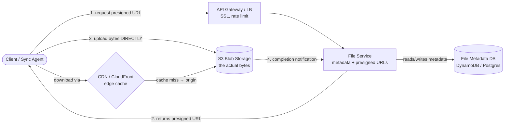
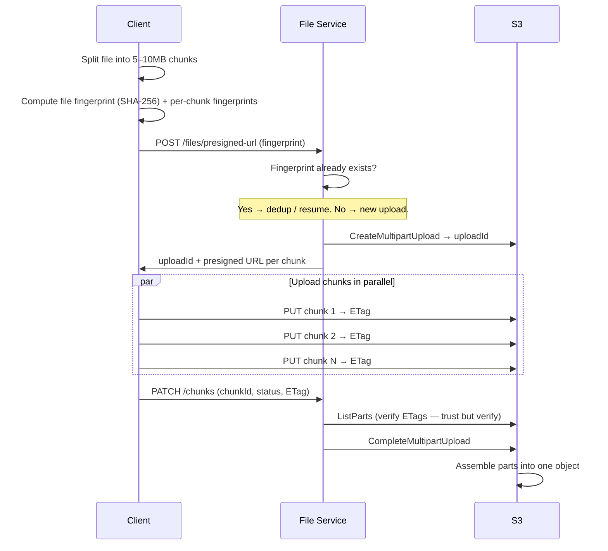
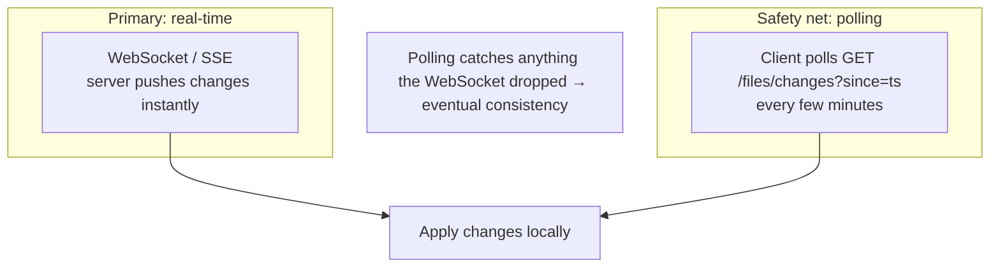

# Designing a File Storage & Sync Service (Dropbox / Google Drive) — Interview Notes

> Self-contained cheat sheet for a system design interview. Everything you need is here — sources: [Hello Interview – Dropbox](https://www.hellointerview.com/learn/system-design/problem-breakdowns/dropbox) and the linked video walkthroughs.

---

## 0. The 30-second pitch

Dropbox lets users **upload**, **download**, **share**, and **auto-sync** files across all their devices. The whole problem splits into two halves: (1) storing the **file bytes** cheaply and reliably at huge scale, and (2) storing the **metadata** (name, size, who owns it, sync state) so clients know what changed. The key trick that separates a good answer from a bad one: **never route file bytes through your application servers** — clients upload/download **directly to/from blob storage (S3)** using **presigned URLs**, and you serve downloads through a **CDN**. Big files are **chunked** so uploads are **parallel, resumable, and deduplicated**.

---

## 1. Requirements

### Functional (what it must do)
1. **Upload** a file from any device.
2. **Download** a file from any device.
3. **Share** a file with other users.
4. **Auto-sync** files across a user's devices (change on one device → appears on the others).

### Non-Functional (how well it must do it)
| Requirement | Target | Why it matters |
|---|---|---|
| **Availability** | Highly available; **prioritize Availability over Consistency** (AP) | A brief sync delay is fine; being down is not |
| **Large files** | Support files up to **50 GB** | Forces chunking + multipart upload |
| **Reliability / durability** | No data loss; recoverable | It's people's files — durability is sacred |
| **Low latency** | Fast upload / download / sync | Users feel every second on big files |

> **The framing insight:** two distinct data planes — **bytes** (huge, immutable blobs → S3 + CDN) and **metadata** (small, queryable, changes often → a database). Design them separately. Keep bytes *off* your app servers.

---

## 2. Core Entities

- **File** — the raw bytes being stored (lives in S3, not your DB).
- **FileMetadata** — name, size, MIME type, owner, status, fingerprint, chunk list.
- **User** — a system user.
- **SharedFile** — a mapping of `(userId → fileId)` granting a user access to a file.

---

## 3. API Design

Note: the API returns **presigned URLs** — the client then talks to S3/CDN directly, not to you.

```
# Upload: get a URL to PUT bytes straight to S3
POST /files/presigned-url
Body: { name, size, mimeType, fingerprint }
Response: { fileId, presignedUrl }   // (for large files → an uploadId + a URL per chunk)

# Download: get a CDN-signed URL to GET bytes
GET /files/{fileId}/presigned-url
Response: { presignedUrl }           // CDN URL, ~5 min expiry

# Share
POST /files/{fileId}/share
Body: { targetUserId }

# Sync: what changed since I last checked?
GET /files/changes?since={timestamp}
Response: ChangeEvent[]

# Report chunk upload progress (large files)
PATCH /files/{fileId}/chunks
Body: { chunkId, status, eTag }
```

> **Why `size >10MB` forces chunking:** API Gateway (and most proxies) cap request payloads at **~10MB**. A 50GB file *cannot* go through one request — hence direct-to-S3 + multipart.

---

## 4. High-Level Architecture



**The golden rule:** the **File Service only touches metadata and mints presigned URLs** (a local, cheap operation using the S3 SDK). **Bytes never pass through it.** This is what lets the system scale — your servers stay small while S3/CDN do the heavy lifting.

---

## 5. Deep Dive 1 — Upload (the "great" solution)

### Simple flow (small files)
1. Client asks File Service for a **presigned upload URL**.
2. File Service generates it via the S3 SDK (no bytes involved), writes metadata with `status: "uploading"`.
3. Client **uploads bytes directly to S3** using that URL.
4. S3 fires a **completion notification** to the File Service.
5. File Service flips metadata to `status: "uploaded"`.

**Why not upload to the backend first?** That would double the bandwidth (client→server→S3) and make your servers a bottleneck. Direct-to-S3 avoids the redundant hop.

### Large files (up to 50GB) → Chunking + Multipart Upload



**Chunking details:**
- Split into **5–10MB** chunks **client-side**.
- Compute a **fingerprint (SHA-256)** for the **whole file** and for **each chunk**.
- Fingerprints enable **resumability** and **deduplication** (below).

**Resumable uploads** — track chunk state in metadata; on reconnect, skip already-uploaded chunks:
```json
"chunks": [
  { "id": "chunk1", "status": "uploaded",     "fingerprint": "..." },
  { "id": "chunk2", "status": "uploading",    "fingerprint": "..." },
  { "id": "chunk3", "status": "not-uploaded", "fingerprint": "..." }
]
```

**Trust but verify:** the client reports each chunk's **ETag** via `PATCH`, but the backend **validates against S3's `ListParts` API** before completing — so a malicious/buggy client can't fake an upload.

### Deduplication via fingerprinting
- The **fingerprint = SHA-256 of the content**. Same content → same fingerprint, even across different users.
- On upload, check if that fingerprint already exists → if so, **skip the byte upload entirely** and just create a new metadata record pointing at the existing blob. Saves storage and bandwidth.
- Note: fingerprint identifies **content**, not a file *record* — two users uploading the same PDF share one blob but get separate metadata rows.

---

## 6. Deep Dive 2 — Download (via CDN)

1. Client requests a download URL from the File Service.
2. File Service returns a **CDN-signed URL** (CloudFront), **not** a raw S3 URL.
3. Client downloads from the **nearest CDN edge** location.
4. CDN caches on first fetch (cache miss → pulls from S3 origin), serves from cache after.

**Why CDN, not direct S3?** Files get served from an edge **close to the user** → far lower latency for a globally distributed user base. First download warms the cache; the rest are fast.

---

## 7. Deep Dive 3 — Sharing

Use a **separate `SharedFile` table**, not a share-list embedded in the file metadata.

```
SharedFile:
  userId  → partition key
  fileId  → sort key
```

- Query "all files shared with me" = a single partition scan by `userId` — efficient.
- Avoids rewriting a big file-metadata row every time you add/remove a viewer, and avoids unbounded share-lists inside one record.

---

## 8. Deep Dive 4 — Syncing Across Devices

Two directions:

### Local → Remote (this device changed a file)
- A **client sync agent** watches the folder for **OS file-system events**.
- Queues changed files locally, uploads via the upload API.
- **Conflict resolution: "last write wins."**

### Remote → Local (another device changed a file) — **Hybrid approach**

- **Active push (WebSocket/SSE):** server notifies clients of changes in real time.
- **Periodic polling (safety net):** every few minutes the client calls `GET /files/changes?since={timestamp}` — guarantees eventual consistency even if the WebSocket silently dropped.

### Delta Sync + Content-Defined Chunking (CDC) — the clever bit
- **Problem with fixed-size chunks:** insert **one byte** near the *start* of a file and every subsequent chunk boundary shifts → every chunk looks "changed" → you re-upload the whole file.
- **Fix — Content-Defined Chunking:** use a **rolling hash (Rabin fingerprinting)** to place chunk boundaries based on **content**, not fixed offsets. Now a small edit only affects the **nearby** chunk(s); the rest keep identical fingerprints.
- **Delta sync:** only upload the chunks whose fingerprints changed → tiny edits sync fast instead of re-uploading 50GB.

---

## 9. Deep Dive 5 — Performance & Security

### Performance
| Technique | Detail |
|---|---|
| **Parallel chunk uploads** | Upload many chunks at once to saturate bandwidth; adapt chunk size to network conditions |
| **Delta sync** | Sync only changed chunks (see CDC above) |
| **Compression** | Compress **before** encryption (encryption randomizes data, killing compressibility). Worth it for text; **skip media** (already compressed, low ratio). Algorithms: **Gzip** (universal), **Brotli** (best ratio), **Zstandard** (fast, great balance) |

### Security
| Layer | How |
|---|---|
| **In transit** | HTTPS everywhere |
| **At rest** | S3 **server-side encryption** — unique per-file keys, stored separately from data |
| **Access control** | **Presigned/signed URLs** with short expiry (**~5 min**). They're bearer tokens — anyone with the URL can use it, so short TTL limits exposure. Optionally bind to IP or require auth cookies |
| **URL validation** | CDN/S3 verifies the signature (path + expiry + restrictions baked in) and denies if invalid/expired |

---

## 10. Data Model

**FileMetadata** (DynamoDB or PostgreSQL):
```json
{
  "id": "uuid",
  "name": "report.pdf",
  "size": 1048576,
  "mimeType": "application/pdf",
  "uploadedBy": "userId",
  "status": "uploading | uploaded",
  "fingerprint": "sha256-of-whole-file",
  "chunks": [ { "id": "chunk1", "status": "uploaded", "fingerprint": "..." } ]
}
```

**SharedFile:**
```json
{ "userId": "partition_key", "fileId": "sort_key" }
```

**DB choice:** DynamoDB or Postgres — both fine. Metadata is small and queryable; the heavy lifting is in S3, so pick for availability and your team's familiarity.

---

## 11. Key Numbers (memorize)

| Thing | Value |
|---|---|
| Max file size | **50 GB** |
| Chunk size | **5–10 MB** |
| API Gateway payload cap | **~10 MB** (⇒ must chunk) |
| Signed URL expiry | **~5 min** |
| 50GB @ 100 Mbps | **~1.11 hours** to upload (justifies resumability + parallelism) |
| Fingerprint / chunk hash | **SHA-256** |

---

## 12. Rapid-fire Q&A (likely follow-ups)

- **Q: Why presigned URLs?** → So bytes go **client↔S3 directly**, never through your servers — no bandwidth bottleneck, cheaper, faster.
- **Q: How upload a 50GB file if the gateway caps at 10MB?** → Chunk into 5–10MB parts, **S3 multipart upload**, parallel + resumable.
- **Q: How do you make uploads resumable?** → Track per-chunk status in metadata; on reconnect, re-upload only `not-uploaded` chunks (identified by fingerprint).
- **Q: How do you dedupe?** → SHA-256 fingerprint of content; if it already exists, skip the byte upload and point new metadata at the existing blob.
- **Q: Why download via CDN not S3?** → Edge caching → low latency for globally distributed users.
- **Q: How to sync efficiently after a 1-byte edit?** → **Content-defined chunking** (rolling hash boundaries) + **delta sync** → only the changed chunk re-uploads.
- **Q: How does a device learn of remote changes?** → WebSocket/SSE push (real-time) + periodic polling (`?since=ts`) as a safety net.
- **Q: Conflict resolution?** → Last-write-wins (mention it's a simplification; real systems may version/merge).
- **Q: How do you verify the client actually uploaded chunks?** → Trust but verify — validate ETags against S3 `ListParts` before `CompleteMultipartUpload`.
- **Q: Compression?** → Before encryption; worth it for text, skip media; Zstd for balance.
- **Q: Sharing at scale?** → Separate `SharedFile` table keyed by `userId` (partition) + `fileId` (sort).

---

## 13. What each level is expected to cover

- **Mid-level:** working high-level design meeting the functional reqs; surface familiarity with the components; interviewer may drive the deep dives.
- **Senior:** advanced principles (blob storage, CDN, presigned URLs); clear trade-off articulation; proactive problem-solving; comfortable with multipart upload APIs.
- **Staff+:** deep expertise across all areas; anticipate challenges (CDC, delta sync, security); draw on real-world experience; peer-level trade-off discussion; exceptional proactivity.

---

### TL;DR walk-in order for the interview
1. Requirements → **call out the two data planes: bytes (S3/CDN) vs metadata (DB)**.
2. Core entities + API (presigned URLs — client talks to S3/CDN directly).
3. High-level design → **File Service only handles metadata + mints presigned URLs; bytes bypass it.**
4. Deep dive: **upload** — chunking (5–10MB), S3 multipart, parallel + resumable + dedup (SHA-256), trust-but-verify ETags.
5. Deep dive: **download** — CDN-signed URLs, edge caching.
6. Deep dive: **sharing** — separate `SharedFile` table.
7. Deep dive: **sync** — WebSocket push + polling safety net; **CDC + delta sync** for efficient small edits.
8. Deep dive: **perf & security** — compress-before-encrypt, parallel chunks; HTTPS + S3 SSE + short-lived signed URLs.
