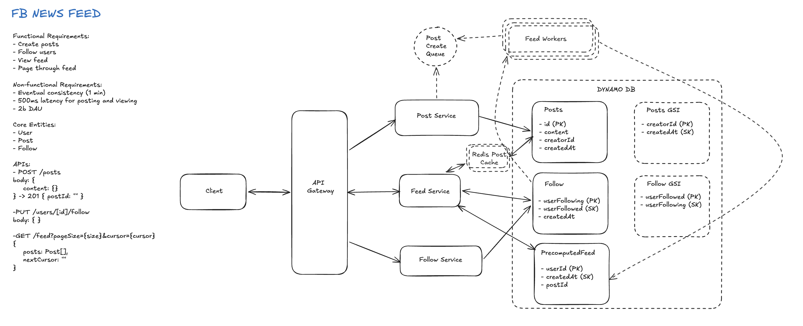
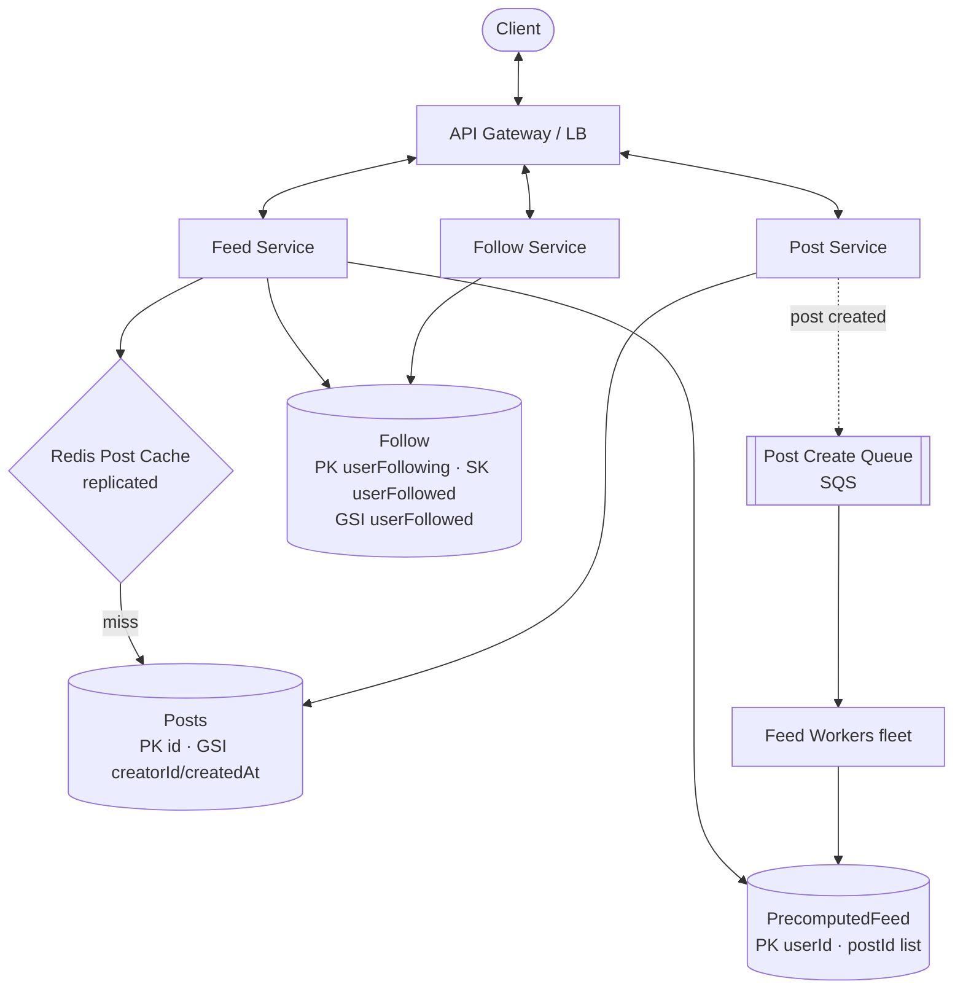
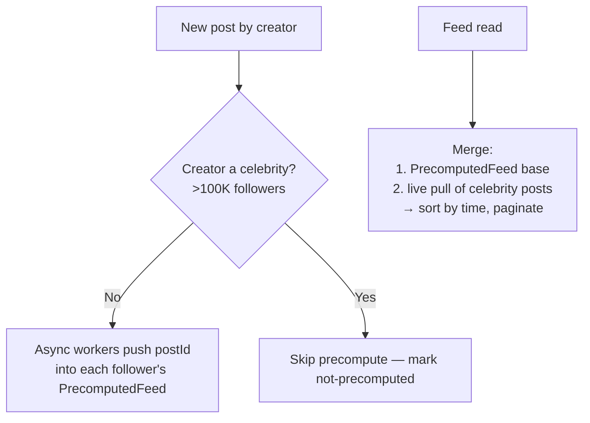

# Designing Facebook News Feed — Interview Notes

> Self-contained cheat sheet for a system design interview. Everything you need is here — source: [Hello Interview – FB News Feed](https://www.hellointerview.com/learn/system-design/problem-breakdowns/fb-news-feed).

---

## 0. The 30-second pitch

The News Feed shows you a reverse-chronological stream of posts from everyone you follow. The whole problem is **assembling that feed fast at 2B-user scale** — and the single decision that dominates the interview is **fanout: do you build each feed at write time (push) or read time (pull)?** Push gives instant reads but explodes on celebrities (one post → millions of writes); pull is cheap to write but slow to read for users following thousands. The answer is a **hybrid**: precompute feeds for normal users (push via async workers), and pull celebrity posts live at read time. Then handle **viral-post hot keys** with a **replicated (not sharded) Redis cache**.

---

## 1. Requirements

### Functional
1. **Create** posts.
2. **Follow / unfollow** users (uni-directional).
3. **View feed** — posts from followed users, reverse-chronological.
4. **Paginate** through the feed (infinite scroll).

**Out of scope:** likes, comments, visibility/privacy controls.

### Non-Functional
| Requirement | Target | Why |
|---|---|---|
| **Availability > Consistency** | Tolerate **up to 1 min staleness** | A slightly-late post is fine; the feed must never be *down* |
| **Latency** | **< 500ms** for posting and feed viewing | Feed must feel instant |
| **Scale** | **2B users** | Drives fanout + storage design |
| **Follower limits** | Unlimited follows/followers | Forces the celebrity/hot-user handling |

> **Framing insight:** eventual consistency (≤1 min) is *explicitly allowed* — that permission is what makes **precomputed feeds via async workers** viable. Say it early; it unlocks the whole design.

---

## 2. Core Entities

| Entity | Meaning |
|---|---|
| **User** | A participant. |
| **Follow** | Uni-directional edge: `userFollowing → userFollowed`. |
| **Post** | Content by a user, visible to followers: `id, creatorId, content, createdAt`. |
| **PrecomputedFeed** | Per-user cached list of recent post IDs (~200), reverse-chronological. |

---

## 3. API Design

```
POST /posts            { content }              → 201 { postId }
PUT  /users/{id}/follow                          → 200
GET  /feed?pageSize={n}&cursor={timestamp?}      → { items: Post[], nextCursor }
```

**Cursor-based pagination** (not offset): the cursor = **timestamp of the oldest post seen**; the next page returns posts *older* than it.
- ✅ Stateless (works across servers), handles deletions gracefully, no offset-skip inefficiency.

---

## 4. High-Level Architecture





**Three stateless, horizontally-scalable services:**
- **Post Service** → writes to `Posts` (DynamoDB), then emits a "post created" event to the queue.
- **Follow Service** → the `Follow` table. PK `userFollowing` + SK `userFollowed` (list who I follow); **GSI** flips it (`userFollowed` PK) to list *my followers*.
- **Feed Service** (read-heavy) → reads the user's `PrecomputedFeed`, hydrates post IDs from the Redis post cache, merges in live celebrity posts, filters unfollows, paginates.

---

## 5. Deep Dive 1 — The Fanout Problem ⭐ the crux

**How do you build a user's feed?** Two opposite strategies:

### Fanout-on-read (Pull)
At read time, query the Follow table, then fetch each followed user's recent posts and merge-sort by time.
- ✅ Cheap writes (a post is just one insert).
- ❌ A user following 1000 accounts → **1000+ queries per feed load** → high read latency.

### Fanout-on-write (Push) — PrecomputedFeed
When a post is created, **push its ID into every follower's precomputed feed** (kept to ~200 posts). Reads are then a single lookup.
- ✅ Instant reads.
- ✅ **Storage is cheap:** ~10 bytes/postID × 200 × 2B users = **~4TB** total. Fine.
- ❌ **Celebrity problem:** one post by someone with 10M followers = **10M writes**.

### ⭐ Solution — Hybrid (push + pull per account)
Decide fanout **per account**:
- **Normal accounts** → **push** (precompute into followers' feeds).
- **Celebrity accounts** (> threshold, e.g. **100K followers**) → **don't precompute**; the Feed Service **pulls their recent posts live** at read time and merges them in.

Store an `isPrecomputed` flag on the Follow edge. Most users experience a blend: precomputed base feed + a few live celebrity merges.



> **The killer line:** *"Choose whether to fan out on read or on write on a per-account basis."* Push where writes are cheap (normal users), pull where writes are catastrophic (celebrities).

---

## 6. Deep Dive 2 — Handling Celebrity/Hot Users (async workers)

Even for non-celebrities, pushing a post to thousands of followers synchronously would blow up the Post Service (connection exhaustion, latency spikes). So **decouple with a queue**:

```
Post created → SQS (postId, creatorUserId) → Feed Worker fleet
  each worker: look up creator's followers → prepend postId to each PrecomputedFeed
```

- **Queue:** at-least-once delivery, millions of items, even work distribution.
- **The catch — uneven work per item:** a post by a 1M-follower user is **1000× the work** of a 1K-follower one. Mitigate by **splitting large fanout tasks** into chunks so one worker isn't stuck for minutes.
- This async pipeline is exactly why **1-minute staleness** is acceptable per the NFRs.

---

## 7. Deep Dive 3 — Feed Storage & Viral-Post Caching (hot keys)

**Problem:** post reads are wildly uneven — most posts read a few times, a **viral post read millions of times in hours**. DynamoDB assumes even key distribution, so a viral post's **single partition/shard gets hammered** (hot key).

| Approach | Verdict |
|---|---|
| Direct DynamoDB reads | ❌ Viral post's shard bottlenecks; other shards idle |
| **Sharded** Redis post cache (key by postId) | 🟡 Better, but the hot key still lands on **one** cache shard |
| **Replicated** (redundant) Redis post cache | ⭐ Multiple **identical** Redis instances; LB spreads reads across all of them |

**⭐ Replicated post cache:** N identical Redis instances (replicated, *not* sharded). A load balancer sends each read to any instance — every instance can serve any post ID, no coordination.
- **Result:** a viral post's traffic spreads across **N instances instead of one shard**.
- **Trade-off:** a brand-new viral post may miss on all N caches at once → N DB reads instead of 1 (small cost for vastly higher total throughput). TTL long-lived, LRU eviction, invalidate on edit.

---

## 8. Deep Dive 4 — Edge Cases (unfollow, new follow, freshness, ranking)

### Unfollow — posts should disappear
- **Lazy (simple):** delete the Follow edge; **Feed Service filters** unfollowed users' posts out of the precomputed feed at read time. ≤1 min staleness OK.
- **Proactive:** background job removes that user's posts from the follower's PrecomputedFeed. More consistent, more complex.

### New follow — recent posts should appear instantly
- Background job fetches the followed user's **recent ~200 posts** (via Posts GSI on `creatorId/createdAt`) and populates the new follower's PrecomputedFeed. New posts then flow through the normal async pipeline.

### Freshness (real-time)
- Base design = ≤1 min via async queue. Optional: **WebSocket** to active viewers so workers can push new posts within seconds. Costs open connections; not required for base reqs.

### Ranking
- Base = **reverse-chronological** (simple, matches reqs).
- Optional **ML ranking**: score by engagement history, dwell time, author affinity, virality. Either store the PrecomputedFeed in ranked order, or sort by ML score at read time. Trade-off: engagement ↑ but complexity, training infra, filter bubbles.

---

## 9. Data Model (DynamoDB)

```
Posts:           PK postId | creatorId, content, createdAt
                 GSI: PK creatorId, SK createdAt      -- "recent posts by user" (pull path)

Follow:          PK userFollowing, SK userFollowed | createdAt, isPrecomputed
                 GSI: PK userFollowed, SK userFollowing -- "who follows me" (fanout path)

PrecomputedFeed: PK userId | [postId...] (up to ~200, reverse-chron)

Post Cache (Redis): key postId → Post object, REPLICATED across N instances
```

---

## 10. Scale / Capacity

| Metric | Value |
|---|---|
| Total users | **2B** |
| DAU | ~500M–1B |
| Posts/day | ~0.1/user/day → **50–100M/day** |
| Feed reads/day | ~3/DAU → **1.5–3B/day** |
| Follower distribution | power law: avg ~100–500, celebs in the millions, tail in dozens |
| PrecomputedFeed size | ~200 posts/user |
| PrecomputedFeed storage | ~10B × 200 × 2B ≈ **~4TB** |
| Staleness budget | ≤ **1 min** |

---

## 11. Trade-offs Summary

| Dimension | Choice | Reasoning |
|---|---|---|
| **Push vs Pull** | **Hybrid** | Push for normal (fast reads); pull for celebrities (bounded writes) |
| **Consistency** | Eventual (≤1 min) | Buys availability + scalability |
| **Feed size** | ~200 posts | Recency vs storage |
| **Hot-post cache** | **Replicated**, not sharded | Spreads viral hot-key load across N instances |
| **DB** | DynamoDB | Horizontal scale, provisioned throughput |
| **Ranking** | Chronological (ML optional) | Simplicity vs engagement |

---

## 12. Rapid-fire Q&A

- **Q: Push or pull?** → Hybrid, per-account: push (precompute) for normal users, pull live for celebrities.
- **Q: Why can't we push for everyone?** → A celebrity post = millions of writes. Pull them at read time instead.
- **Q: Why not pull for everyone?** → A user following 1000 accounts = 1000+ queries per feed load. Precompute normal feeds.
- **Q: Where's the celebrity threshold?** → ~100K followers (a tunable flag on the Follow edge).
- **Q: How does a post reach millions of feeds?** → Async: post → SQS → worker fleet prepends to each follower's PrecomputedFeed.
- **Q: What about a worker stuck on a 1M-follower fanout?** → Split the fanout task into chunks across workers.
- **Q: Viral post read millions of times — DynamoDB hot key?** → Replicated (not sharded) Redis post cache; LB spreads reads across N identical instances.
- **Q: Pagination?** → Cursor = timestamp of oldest seen post; fetch older-than-cursor. Stateless, deletion-safe.
- **Q: Unfollow?** → Lazy filter at read time (or proactive background removal).
- **Q: New follow shows nothing?** → Background job backfills recent ~200 posts into the new follower's feed.
- **Q: Real-time?** → Optional WebSocket push to active viewers; base design is ≤1 min via queue.
- **Q: How is the feed ranked?** → Chronological baseline; optional ML scoring for engagement.

---

## 13. What each level is expected to cover

- **Mid (E4):** clear API + data model; post/follow/feed retrieval; mention caching/scaling. (~40%)
- **Senior (E5):** speed through basics; 2+ deep dives — **fanout push/pull/hybrid**, celebrity scaling, trade-offs. (~60–70%)
- **Staff+ (L7):** all deep dives + emerging issues (cache coherency, cascading failures); worker tuning, threshold selection; evident real-world experience. (~90%+)

---

### TL;DR walk-in order
1. Requirements → **call out eventual consistency (≤1 min)** — it unlocks precomputed feeds.
2. Entities (User, Follow, Post, PrecomputedFeed) + API (cursor pagination).
3. High-level design: Post / Follow / Feed services + DynamoDB (+ GSIs).
4. Deep dive: **fanout** — pull vs push → **hybrid per-account** (celebrity threshold).
5. Deep dive: **celebrity handling** — SQS + worker fleet, split large fanouts.
6. Deep dive: **hot-key caching** — replicated Redis post cache for viral posts.
7. Edge cases: unfollow filtering, new-follow backfill, freshness (WebSocket), ML ranking.
