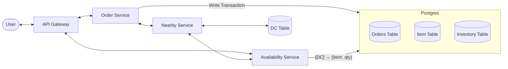
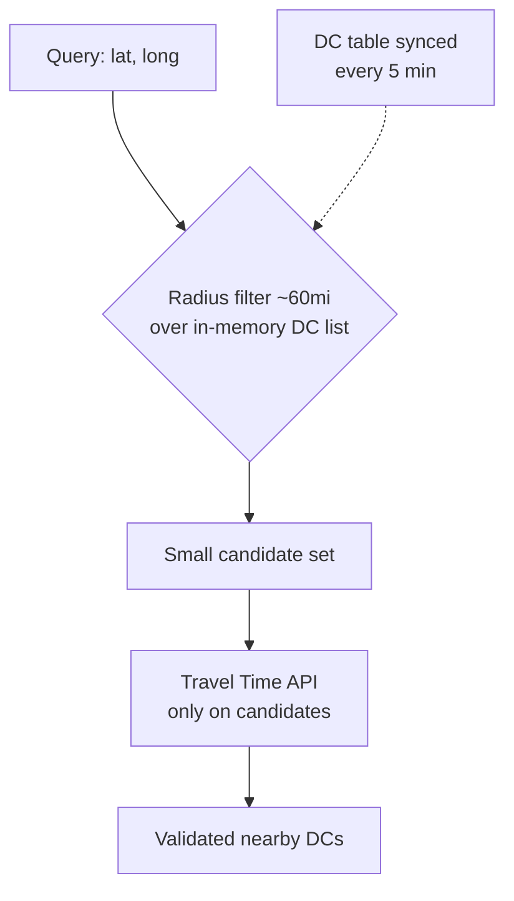
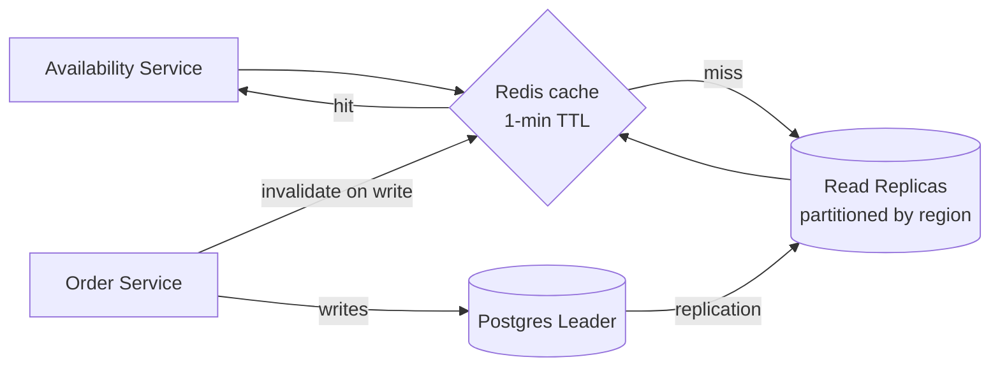
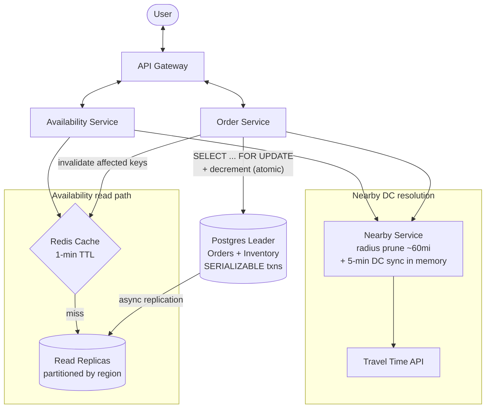

# Designing Gopuff (Rapid Delivery / Instant Commerce) — Interview Notes

> Self-contained cheat sheet for a system design interview. Everything you need is here — source: [Hello Interview – Gopuff](https://www.hellointerview.com/learn/system-design/problem-breakdowns/gopuff).

---

## 0. The 30-second pitch

Gopuff delivers convenience items in **under an hour** from **distribution centers (DCs)** near you. Two problems dominate: (1) **availability** — "what can I get delivered to *this* location within an hour?", which means aggregating inventory across the **nearby DCs** *fast* (read-heavy, ~20k QPS, needs caching); and (2) **ordering** — placing an order **without ever selling the same physical unit twice** (write path, needs **strong consistency**). The elegant answer: colocate orders + inventory in **one Postgres** and place each order as a **single SERIALIZABLE transaction with row locks** — which sidesteps distributed locks and 2PC entirely.

---

## 1. Requirements

### Functional
1. **Availability query**: given a user's location, return items deliverable within 1 hour, **aggregated across nearby DCs**.
2. **Order placement**: order **multiple items at once** for delivery.

**Out of scope** (say it): payments, driver routing/dispatch, search/catalog APIs, cancellations, returns.

### Non-Functional
| Requirement | Target | Why |
|---|---|---|
| **Availability latency** | **< 100ms** | Powers browse/search — must feel instant |
| **Order consistency** | **Strong consistency** (no overselling) | Two users must never buy the same physical unit |
| **Scale** | **10k DCs**, **100k catalog items** | Bounds the geospatial + partitioning design |
| **Volume** | **~10M orders/day** (~115 orders/sec); **~20k availability QPS** | 10:1 query-to-purchase ratio → reads dominate |

> **Framing insight:** the two paths have *opposite* needs. **Availability = read-heavy, latency-critical → cache + replicas + eventual consistency is OK.** **Ordering = write path, correctness-critical → strong consistency, single ACID transaction.** Design them separately.

---

## 2. Core Entities

| Entity | Meaning |
|---|---|
| **Item** | A product *type* (e.g. "Cheetos") — catalog abstraction. `id, name, description` |
| **Inventory** | A *physical* stock unit of an item **at a specific DC** — the thing that actually gets sold. `itemId, dcId, quantity, status` |
| **DistributionCenter (DC)** | Physical location holding inventory. `id, lat, long, zipcode, regionId` |
| **Order** | A collection of inventory purchased by a user. `orderId, userId, dcId` |

> **The subtle distinction interviewers probe:** `Item` ≠ `Inventory`. An Item is the catalog concept; Inventory is the count of that item *in one DC*. Availability = **summing Inventory across nearby DCs** for each Item.

---

## 3. API Design

```
GET /availability?lat={}&long={}&filters=...
→ aggregated item availability across nearby DCs (paginated)

POST /orders
Body: { lat, long, items: [{ itemId, quantity }] }
→ order confirmation, or failure (insufficient inventory)
```

Both take **location** — needed to validate the 1-hour delivery radius.

---

## 4. High-Level Architecture — INITIAL (your hand-drawn version)

This is the correct starting point — services, tables, and the write transaction:



**Data model on the diagram:**
- `Order`: OrderId, InventoryId, Quantity
- `Item`: Id, Name, Description
- `Inventory`: ItemId, DCId, Quantity
- `DistributionCenter`: Id, Lat, Long

**Flows:**
- **Availability:** Availability Service → Nearby Service (which DCs?) → query Inventory+Item for those DCs → sum → return.
- **Order:** Order Service → validate location → **single atomic transaction** (check inventory > 0, create order, decrement inventory) → confirm/fail.

The three deep dives below evolve *this* into the final architecture.

---

## 5. Deep Dive 1 — Finding Nearby DCs (geospatial + travel time)

**Problem:** "nearby" isn't straight-line distance — traffic, rivers, and the **1-hour drive constraint** matter. But calling a Travel Time API against **all 10k DCs** per query is absurd.

**Solution — hybrid prune-then-verify:**
1. **Prune by radius:** filter to DCs within **~60 miles** (max optimistic 1-hour drive). Cuts 10k → a handful.
2. **Keep DCs in memory:** the DC table is small and rarely changes — **sync it into the Nearby Service every ~5 minutes**. No DB hit per query.
3. **Call Travel Time API** only on the *pruned* candidate set.
4. Return the validated serviceable DCs.

**Impact: ~95% fewer external travel-time calls** while staying accurate.



> Geospatial index options if you didn't keep DCs in memory: **PostGIS**, **Redis GEO (geohash)**, or a **quadtree**. Here the DC set is tiny (10k), so an in-memory radius scan is simplest — the lazy correct choice.

---

## 6. Deep Dive 2 — Fast Availability at 20k QPS

**Scale math:** 10M orders/day ÷ ~5% conversion ≈ 20M sessions × ~10 availability queries = **200M queries/day ≈ 20k QPS.** Hitting the primary DB directly is unsustainable.

**Two complementary techniques (use both):**

### (a) Redis cache — hot reads
- Key: `availability:{region}:{dc_set_hash}` → snapshot of item availability.
- **TTL: ~1 minute** (balances freshness vs hit rate — stale-by-a-minute availability is acceptable; the *order* transaction is the real source of truth).
- **Invalidation:** Order Service purges affected entries when it mutates inventory → staleness stays < ~1s in practice.

### (b) Region-partitioned read replicas — the fallback
- **Partition Inventory by region** (e.g. first 3 digits of zipcode).
- Each availability query touches only **1–2 partitions**, not the whole table.
- Route **reads → replicas**, **writes (orders) → leader**. Scale replicas **independently per region** (dense cities get more).



**Result: sub-100ms p95 availability.**

---

## 7. Deep Dive 3 — Order Atomicity (never oversell) ⭐ the crux

**Problem:** two users must never buy the same physical unit.

### What NOT to do
- **Distributed locks + separate DBs:** crash *after* creating the order but *before* decrementing inventory → the unit looks available again → oversold. Also deadlock risk (User1 locks A→B, User2 locks B→A).
- **Two-Phase Commit (2PC):** complex, slow, operationally painful. Overkill here.

### ⭐ Great solution: one Postgres, one SERIALIZABLE transaction
Colocate Orders + Inventory in the **same database** so a single ACID transaction covers everything — no distributed coordination needed.

```sql
BEGIN TRANSACTION ISOLATION LEVEL SERIALIZABLE;

-- Lock the exact inventory rows so no one else can touch them
SELECT quantity FROM inventory
  WHERE item_id IN (1,2,3) AND dc_id IN (...)
  FOR UPDATE;                       -- row-level lock

-- Validate every requested qty is available; else ROLLBACK

INSERT INTO orders (...) VALUES (...);
INSERT INTO order_items (...) VALUES (...);
UPDATE inventory SET quantity = quantity - ?
  WHERE item_id IN (...);

COMMIT;                             -- order + decrement are all-or-nothing
```

**Why it works:**
- `SELECT … FOR UPDATE` **locks the rows** — a concurrent order for the same unit blocks until this commits.
- **SERIALIZABLE** isolation prevents phantom/concurrent-read anomalies.
- Order creation **and** inventory decrement are **atomic** — no crash window where stock leaks.
- Postgres ACID **eliminates the race** without any distributed machinery.

**Trade-off:** it's **all-or-nothing per order** — if *any* item is out of stock, the whole order fails (no partial fulfillment). Acceptable for convenience bundles where you want the whole basket or nothing.

> Alternative worth naming: **reservations with a TTL** (mark units `reserved` for N minutes during checkout, auto-release if unpaid). The breakdown favors the single transaction for simplicity; mention reservations if the interviewer adds a payment step.

---

## 8. Data Model (final)

```
Inventory:  id (PK), item_id (FK), dc_id (FK), quantity,
            status (available | ordered | reserved), created_at, updated_at
Orders:     id (PK), user_id, dc_id, created_at
OrderItems: order_id (FK), item_id, inventory_id (FK), quantity
Item:       id (PK), name, description
DistributionCenter: id (PK), latitude, longitude, zipcode, region_id
```

---

## 9. FINAL Architecture (after all three deep dives)

This is your diagram, evolved: Nearby Service gains the **Travel Time API + 5-min DC sync**; Availability gains **Redis + region-partitioned read replicas**; Orders write via a **SERIALIZABLE transaction to the leader**.



### Optimization summary
| Component | Optimization | Impact |
|---|---|---|
| **Nearby DCs** | Radius prune (~60mi) before Travel Time API + in-memory DC list | ~95% fewer external calls |
| **Availability reads** | Redis (1-min TTL) + region-partitioned replicas | < 100ms p95 at 20k QPS |
| **Inventory writes** | Single SERIALIZABLE txn + `FOR UPDATE` | Zero overselling |
| **Cache freshness** | Order Service invalidates on write | < ~1s staleness |
| **Scaling** | Per-region replica scaling | Handles 20k QPS unevenly across geography |

---

## 10. Rapid-fire Q&A

- **Q: Item vs Inventory?** → Item = catalog type; Inventory = physical count of that item at one DC. Availability sums Inventory across nearby DCs.
- **Q: How find nearby DCs without 10k API calls?** → In-memory DC list, ~60mi radius prune, then Travel Time API on the survivors. ~95% fewer calls.
- **Q: How hit <100ms at 20k QPS?** → Redis cache (1-min TTL) fronting region-partitioned read replicas.
- **Q: Is stale availability OK?** → Yes — ~1 min is fine; the order transaction is the real source of truth and will reject if stock actually ran out.
- **Q: How prevent overselling?** → Single Postgres, one SERIALIZABLE transaction, `SELECT … FOR UPDATE` locks the inventory rows; order + decrement atomic.
- **Q: Why not distributed locks / 2PC?** → Crash windows leak inventory; deadlocks; latency + ops overhead. Colocating in one DB makes a plain ACID txn sufficient.
- **Q: What if one item in a multi-item order is out of stock?** → Whole order fails (all-or-nothing). Acceptable for bundles.
- **Q: Reads vs writes DB?** → Writes → leader; reads → replicas partitioned by region (first 3 zip digits).
- **Q: Handling a payment step?** → Switch to **reservation with TTL** (`status=reserved`, auto-release if unpaid) so you don't hold a hard lock across a slow payment.

---

## 11. What each level is expected to cover

- **Mid-level:** define API + data model; outline both flows; name caching + transactions as the tools.
- **Senior:** speed through basics; deeply optimize the critical paths (travel-time pruning, cache strategy, transaction isolation) and articulate trade-offs.
- **Staff+:** proactively surface the 20k-QPS bottleneck; propose the partitioning scheme; go 2–3 levels deep with "I've built this" specificity.

---

### TL;DR walk-in order
1. Requirements → **split the two paths: availability (read, <100ms, cacheable) vs ordering (write, strongly consistent).**
2. Entities (**Item vs Inventory** distinction) + API.
3. High-level design (Availability Svc, Order Svc, Nearby Svc, Postgres).
4. Deep dive: **nearby DCs** — radius prune + Travel Time API + in-memory sync.
5. Deep dive: **fast availability** — Redis (1-min TTL) + region-partitioned replicas.
6. Deep dive: **order atomicity** — single SERIALIZABLE Postgres txn + `FOR UPDATE`; why not distributed locks/2PC.
7. Present the **final architecture** + optimization table.
