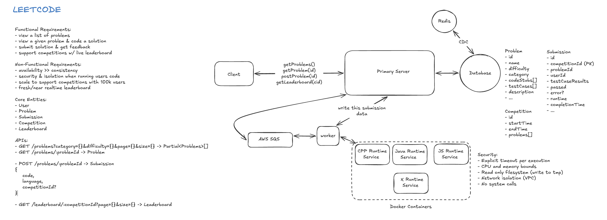
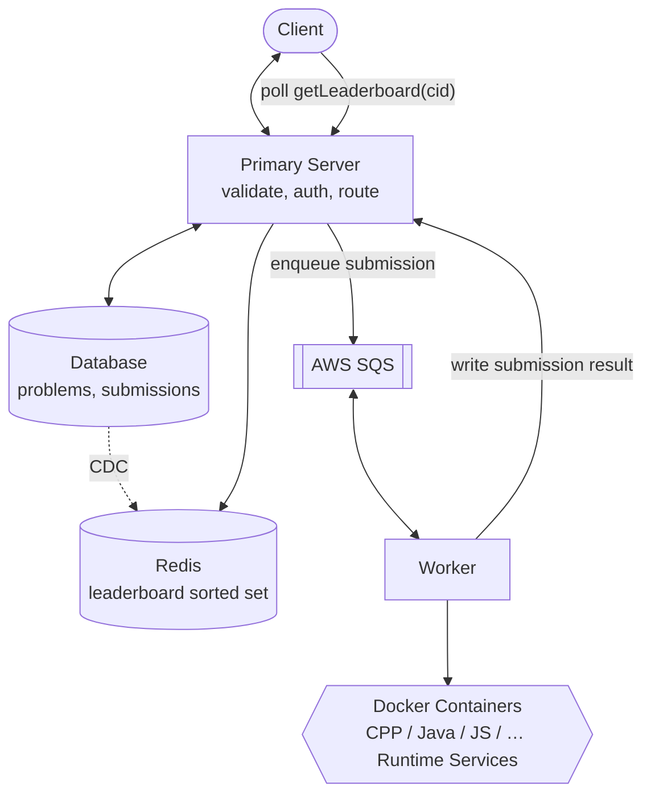

# Designing LeetCode (Online Coding Judge) — Interview Notes

> Self-contained cheat sheet for a system design interview. Everything you need is here — source: [Hello Interview – LeetCode](https://www.hellointerview.com/learn/system-design/problem-breakdowns/leetcode).

---

## 0. The 30-second pitch

LeetCode lets users **browse coding problems, submit solutions in multiple languages, get pass/fail feedback in seconds**, and **watch a live contest leaderboard**. The whole design hinges on one dangerous fact: **you are running untrusted user code on your servers.** So the crux is **secure, isolated, resource-limited execution** (→ locked-down **Docker containers**), scaled behind a **queue + worker pool** so a contest's thundering herd just deepens the queue instead of melting the box. Results come back via **short-polling** (not WebSockets), and the live leaderboard is a **Redis sorted set**.

---

## 1. Requirements

### Functional
1. **List** problems (paginated).
2. **View** a problem + code in multiple languages.
3. **Submit** a solution → get pass/fail feedback.
4. **View** a live competition **leaderboard**.

**Out of scope:** auth, profiles, payments, analytics, social.

### Non-Functional
| Requirement | Target | Why |
|---|---|---|
| **Secure isolated execution** | Untrusted code can't harm the host or others | The defining constraint — running arbitrary code |
| **Result latency** | **< 5s** | Submissions must feel near-instant |
| **Scale** | **100K concurrent** users in a contest | Drives queue + autoscaling + thundering-herd handling |
| **Availability > consistency** | Prefer up over perfectly consistent | A slightly stale leaderboard is fine |

> **Framing insight:** this is really two systems — a **read-mostly content app** (problems, leaderboard) and an **untrusted-code execution engine**. Almost all the interesting design is in the execution engine's **security + scaling**.

---

## 2. Core Entities

| Entity | Meaning |
|---|---|
| **Problem** | id, title, statement, difficulty, tags, **code stubs per language**, **test cases** (serialized input/output) |
| **Submission** | userId, problemId, code, language, timestamp, result (pass/fail + per-test), executionTime, competitionId |
| **Leaderboard** | per competition: userId → (problems solved, time-to-solve) |
| **User** | id + minimal profile |

---

## 3. API Design

```
GET  /problems?page=1&limit=100          → Partial<Problem>[]
GET  /problems/:id?language=python        → Problem (full, with stub)
POST /problems/:id/submit                 → { jobId }        (async!)
GET  /submissions/:id                      → Submission        (poll: 202 while pending)
GET  /leaderboard/:competitionId?page=&limit=  → Leaderboard[]
```

> **Security note:** userId comes from the **session/JWT, never the client body**; timestamps are **server-generated**. Submit is **asynchronous** — returns a `jobId`, client polls for the result.

---

## 4. High-Level Architecture





> **Diagram alignment:** the hand-drawn version keeps the leaderboard fresh by streaming submission results **DB → Redis via CDC** (instead of the worker writing Redis directly) — either is fine to say; CDC decouples the worker from the leaderboard. Submission is keyed by **`competitionId` (PK)** there; per-language logic is split into separate **Runtime Services** (one container image per language) rather than one generic worker.

**Submission data flow:**
1. `POST /submit` → API validates, writes submission `status=pending`, enqueues `jobId`.
2. Worker pulls job, loads problem + test cases.
3. Worker mounts user code into a **locked-down Docker container**, runs it against tests.
4. Container writes results to stdout/temp; worker reads exit code + output.
5. Worker updates DB + Redis leaderboard.
6. Client **polls** `GET /submissions/:id` (~1–2s) until done.

---

## 5. Deep Dive 1 — Secure Code Execution ⭐ the crux

**The risk:** untrusted code could crash the host, read secrets, attack the network, fork-bomb, or delete files.

**Choice of isolation:**
| Approach | Startup | Isolation | Verdict |
|---|---|---|---|
| Direct execution | instant | **none** | ❌ never |
| VMs | ~1–2s | full OS | strong but heavy |
| **Containers (Docker)** | ~100–200ms | kernel/process | ⭐ right balance |

**Container hardening checklist (say all of these):**
1. **Resource limits:** `--cpus=1` (0.5–1 vCPU), `--memory=512m` (256–512MB) hard cap → killed if exceeded.
2. **Timeout:** 5–10s wall-clock kill → catches infinite loops.
3. **Read-only filesystem:** mount code/problem read-only; `--tmpfs /tmp` for scratch, wiped after.
4. **No network:** `--network=none` (no egress) → can't exfiltrate or attack.
5. **seccomp syscall whitelist:** allow `read/write/mmap/exit`; block socket creation, fork, file delete.
6. **Drop Linux capabilities** (no `CAP_SYS_ADMIN`, etc.); run as **unprivileged user** (UID ≥ 1000).
7. **Stronger isolation if needed:** gVisor / Firecracker microVMs (usually overkill at LeetCode scale — mention as the "staff+" upgrade).

```
docker run --rm --cpus=1 --memory=512m --network=none \
  --read-only --tmpfs /tmp --user 1000 \
  --security-opt seccomp=profile.json \
  leetcode-python:latest /runner.py    # 10s timeout enforced by worker
```

---

## 6. Deep Dive 2 — Scaling to 100K Concurrent (queue + worker pool)

**Capacity math:** 100K users, 10-min window, ~10% submit/min = **10K submissions/min**. At ~3s each, one container ≈ 20 submissions/min → need **~500 containers** at peak.

**Architecture: queue + per-language autoscaled worker pools.**
```
API servers → SQS → worker pool (autoscaling group)
   ├─ python pool   ├─ javascript pool
   ├─ java pool     └─ c++ pool ...
→ DynamoDB + Redis
```

**Autoscaling on queue depth** (the key signal):
```
queue_depth > 1000        → add 50 workers
queue_depth < 100 for 2m  → remove 10 workers
min 10/lang, max 500/lang    (also scale on container CPU)
```

**Why a queue:** buffers contest-start spikes, enables **retries on container crash**, decouples API from execution, scales the execution tier independently.
**Trade-off:** async → client must poll; accept ~1–2s latency (still within the 5s SLA).

---

## 7. Deep Dive 3 — Real-Time Leaderboard (Redis sorted set)

**Bad:** `GROUP BY userId ... ORDER BY solved, time` over millions of submission rows every 5s → DB meltdown.

**⭐ Solution:** on each accepted submission, update **both** the DB (permanent) **and a Redis sorted set** (live):
```
ZADD competition:leaderboard:{compId} {score} {userId}
ZRANGE competition:leaderboard:{compId} 0 99 REV WITHSCORES   # top 100
```

**Score encodes rank + tie-break in one number** (more solved wins; faster time breaks ties):
```
score = problemsSolved * 10^8 + (MAX_TIME - timeInSeconds)
# e.g. 5 solved in 1200s → 5*10^8 + (9999-1200) = 500008799
```

**Client:** **poll every ~5s** (2s in the final 5 min, 10s otherwise). **WebSockets are unnecessary** — Redis + polling is fast enough. Cache the leaderboard ~5s server-side; paginate with `ZRANGE`. `EXPIRE` the key ~24h after the contest.

---

## 8. Deep Dive 4 — Language-Agnostic Test Cases

**Challenge:** run the *same* test cases against Python/Java/C++ without rewriting the suite per language.

**Solution:** store test cases as **serialized, language-agnostic strings**; each language ships a **deserialization harness**.
```json
"testCases": [ { "id":1, "type":"tree", "input":"[3,9,20,null,null,15,7]", "output":"3" } ]
```
Serialization formats: **trees** → level-order BFS array (`[3,9,20,null,null,15,7]`); **linked lists** → `"1,2,3"`; **graphs** → adjacency list `[[1,2],[0,3],...]`.

Each container's **runner** deserializes input for the language, calls the user's `Solution`, compares output to expected, emits `{id, passed, output, expected}` as JSON. Test cases stay language-neutral; only the thin harness is per-language.

---

## 9. Deep Dive 5 — Thundering Herd at Contest Start

100K users submitting at `t=0`.
- **Pre-provision:** ~1h before, warm **80% of peak containers** (kill cold starts); pre-scale DB read replicas.
- **Client throttling:** random **jitter (0–5s)** + exponential backoff on polling.
- **Rate limiting:** per-user 1 submission / 2s; per-language cap; reject excess with **429**.
- **Leaderboard reads:** 5s server-side cache + CDN for static pages + aggressive pagination.

---

## 10. Result Communication — Polling vs WebSocket vs SSE

| Approach | Verdict |
|---|---|
| **Short-polling** (client hits `GET /submissions/:id` every ~1s; `202` = still processing) | ⭐ Recommended — simple, scales, easy retries; ~1s latency |
| WebSockets | Overkill — 100K persistent connections, hard to scale |
| SSE | Better than polling for push, but still connection pooling overhead |

> **Polling is the answer.** The 5s SLA doesn't need real-time push, and polling sidesteps 100K-connection management.

---

## 11. Data Model

```
Problem (DynamoDB):
  PK problemId, SK version | title, statement(md), difficulty, tags,
  codeStubs{lang→code}, testCases[{type,input,output}], acceptance_rate
  GSI: by difficulty (for listing)

Submission (DynamoDB):
  PK competitionId#userId, SK submittedAt |
  problemId, code(≤400KB), language, passed, testResults[], executionTime, error
  GSI: competitionId#problemId#userId (dedup) · TTL 90 days

Leaderboard (Redis sorted set only):
  key competition:leaderboard:{compId} → {userId: score}
  score = solved*10^8 + inverted_time · TTL = contest + 24h
```

---

## 12. Key Numbers

| Parameter | Value |
|---|---|
| Container CPU / memory | **1 vCPU / 512 MB** |
| Execution timeout | **10s** (2× the 5s user SLA) |
| Max code size | **400 KB** |
| Leaderboard poll interval | **5s** (2s in final minutes) |
| Peak submissions | ~10K/min → ~500 concurrent → **~500 containers** |
| Languages | Python, JS, Java, C++, Go, Rust |
| Submission TTL | 90 days |

---

## 13. Trade-offs Summary

| Choice | vs Alternative | Trade-off |
|---|---|---|
| **Containers** | VMs | faster startup / weaker isolation (mitigated by hardening) |
| **Queue + workers** | direct execution | reliability + spike buffering / +1–2s latency |
| **Redis sorted set** | DB aggregation query | speed / eventual consistency |
| **Polling** | WebSockets | simpler + scalable / not truly real-time |
| **gVisor/Firecracker** | plain Docker | stronger isolation / more overhead (usually overkill) |

---

## 14. Rapid-fire Q&A

- **Q: How run untrusted code safely?** → Locked-down Docker: CPU/mem limits, 10s timeout, `--network=none`, read-only FS, seccomp whitelist, dropped caps, unprivileged user.
- **Q: Containers vs VMs?** → Containers: ~100–200ms start vs 1–2s; harden them to close the isolation gap; gVisor/Firecracker if you need more.
- **Q: How handle 100K concurrent submissions?** → Queue (SQS) + per-language autoscaled worker pools; scale on queue depth; ~500 containers at peak.
- **Q: Why async + polling not sync?** → Decouples API from execution, buffers spikes, allows retries; poll `GET /submissions/:id` (202 while pending).
- **Q: Real-time leaderboard?** → Redis sorted set (`ZADD`/`ZRANGE REV`); score = solved·10^8 + inverted time (ties broken by speed); poll every 5s.
- **Q: Same tests across languages?** → Serialize test cases language-agnostically (BFS array / CSV / adjacency list); per-language runner deserializes + compares.
- **Q: Contest-start thundering herd?** → Pre-warm 80% of containers, client jitter + backoff, per-user rate limit (429), cache/CDN the leaderboard.
- **Q: WebSockets for results?** → No — polling scales better for 100K users; 5s SLA doesn't need push.
- **Q: Infinite loop / fork bomb?** → Wall-clock timeout kills it; dropped caps + seccomp block forking; memory cap kills bloat.

---

## 15. What each level is expected to cover

- **Mid:** functional design, containers for isolation, basic API + schema; interviewer drives deep dives.
- **Senior:** container security specifics (seccomp, caps), Redis-vs-polling trade-off, scaling math, the test harness, async flow, tie-breaking.
- **Staff+:** proactive problem-finding — pre-provisioning, client jitter, full security model, language runtime architecture, graceful degradation.

---

### TL;DR walk-in order
1. Requirements → **the defining constraint is running untrusted code securely; scale to 100K in contests.**
2. Entities (Problem, Submission, Leaderboard) + API (async submit + poll).
3. High-level: API → queue → worker pool → container; DB + Redis.
4. Deep dive: **secure execution** — locked-down Docker (limits, timeout, no-net, seccomp, caps).
5. Deep dive: **scaling** — queue + per-language autoscaled workers (~500 containers).
6. Deep dive: **leaderboard** — Redis sorted set + composite score + 5s polling.
7. Deep dive: **language-agnostic test cases**; **thundering herd** (pre-warm + jitter + rate limit).
