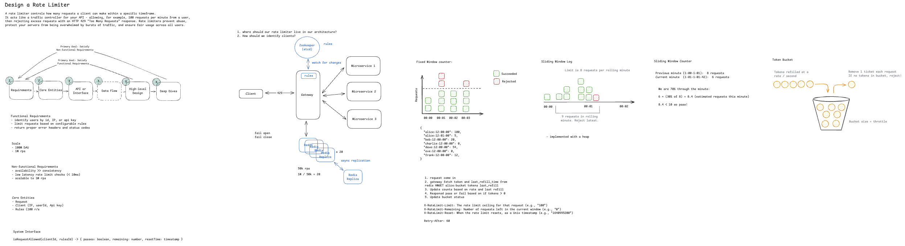
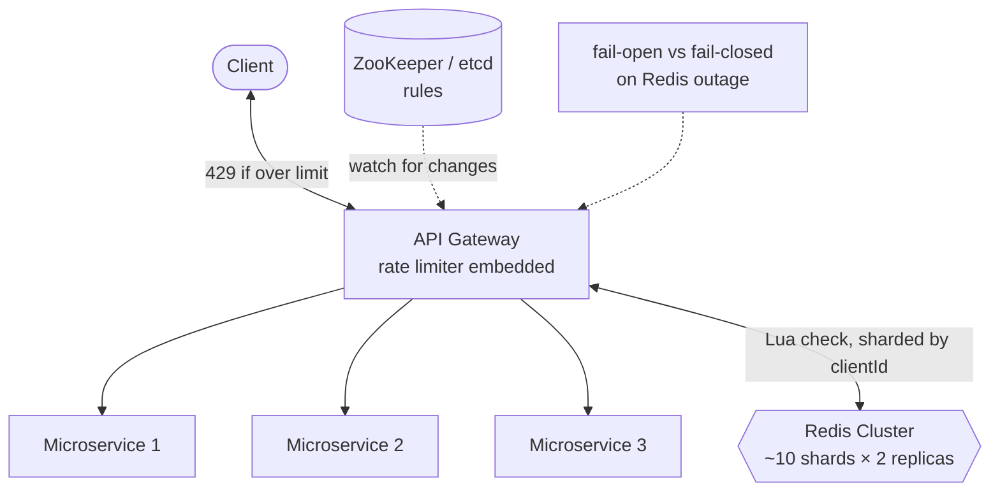
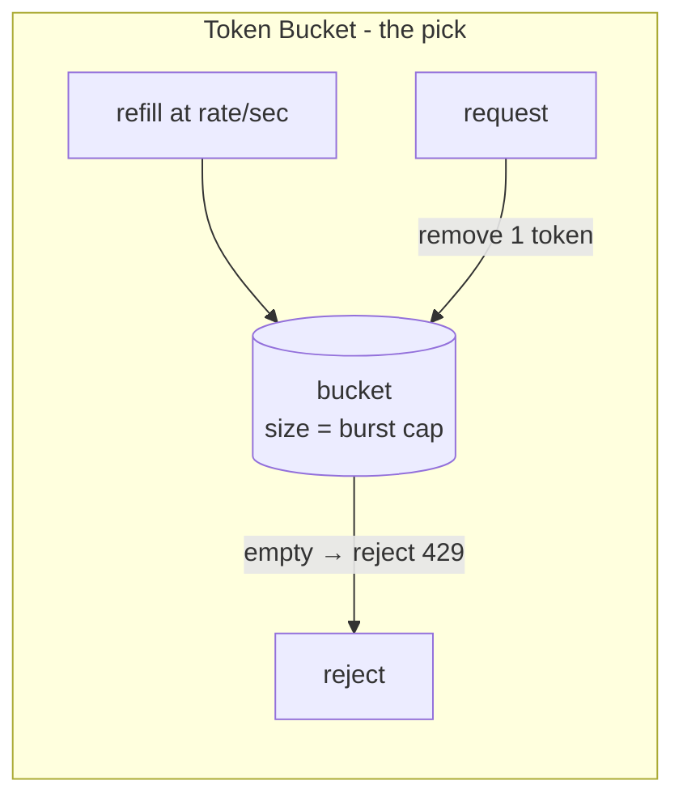
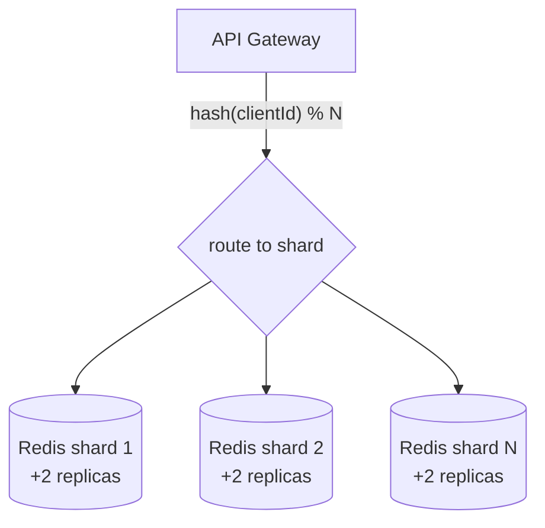

# Designing a Distributed Rate Limiter — Interview Notes

> Self-contained cheat sheet for a system design interview. Everything you need is here — sources: [Hello Interview – Distributed Rate Limiter](https://www.hellointerview.com/learn/system-design/problem-breakdowns/distributed-rate-limiter) + [Design a Rate Limiter (YouTube)](https://www.youtube.com/watch?v=MIJFyUPG4Z4).

---

## 0. The 30-second pitch

A rate limiter is a **traffic controller for your API**: it caps how many requests a client can make in a time window (e.g. 100 req/min per user) and rejects the excess with **HTTP 429 Too Many Requests**. It exists to **prevent abuse, protect backends from traffic bursts, and ensure fair usage**. The design hinges on three decisions: (1) **where it lives** → in the **API Gateway** (edge, already in the path, zero extra app latency); (2) **which algorithm** → **Token Bucket** (handles bursts, 2 values per client, used by Stripe); (3) **shared state at scale** → **Redis**, with the whole read-modify-write done atomically in a **Lua script** to kill race conditions, and **sharded by client ID** to hit 1M req/s. Everything else is "fail-closed vs fail-open," rule distribution, and hot keys.

---

## 1. Requirements

### Functional
1. **Identify clients** by user ID (JWT), IP (`X-Forwarded-For`), or API key (`X-API-Key`).
2. **Limit requests by configurable rules** — per-user, per-IP, per-endpoint, global; e.g. "100 req/min per user".
3. **Reject with HTTP 429** and proper rate-limit headers + status codes.

**Out of scope:** analytics/querying on rate-limit data, long-term persistence.

### Non-Functional
| Requirement | Target | Why |
|---|---|---|
| **Low overhead** | **< 10ms** per check (p99) | Rate limiting sits in the hot path of every request |
| **Availability > consistency** | Eventual consistency OK | A few extra requests slipping through across nodes is tolerable |
| **Scale** | **1M req/s**, **100M DAU** | Drives Redis sharding |
| **Scalable** | Horizontally to 1M+ req/s | Add shards + gateways |

> **Framing insight:** state the **availability-over-consistency** call early — it's what lets you shard Redis and accept small cross-node overcounting instead of paying for global coordination on every request.

---

## 2. Core Entities

| Entity | Meaning |
|---|---|
| **Client** | Who is being limited — `(IP, userId, API key)`. The identity you hash on. |
| **Rule** | A policy: requests per window, which clients/endpoints it covers. e.g. "100 req/s", "authenticated users: 1000 req/hour". |
| **Request** | Incoming call carrying client identity + endpoint + timestamp; evaluated against rules → allow/deny. |

---

## 3. System Interface

```
isRequestAllowed(clientId, ruleId) -> {
  passes:    boolean,     // allow or reject
  remaining: number,      // requests left in the current window
  resetTime: timestamp    // when the window resets
}
```
One call, synchronous, on the request's critical path — so it must be fast and atomic.

---

## 4. High-Level Architecture — where does the limiter live? ⭐





**Three placements — pick the gateway:**
| Placement | Verdict |
|---|---|
| **In-process** (per app server, local counters) | ❌ Each server sees only *its* slice of traffic — 5 servers × 100 = 500 before anyone notices. No shared state. |
| **Dedicated service** (separate microservice) | 🟡 Centralized, but adds a network hop per request + is a SPOF needing fail-open/closed. |
| **API Gateway / LB (edge)** | ⭐ Already in the request path (no *extra* latency), centralized control, protects backends before they're touched. **Limitation:** only request-level context (headers/URL/IP), not deep business logic. |

Rules are stored centrally (**ZooKeeper/etcd** or a config DB) and distributed to every gateway; gateways keep rate-limit **counters in Redis** (shared across all gateway instances).

---

## 5. Deep Dive 1 — The Algorithms ⭐ (know all five, pick Token Bucket)

### a) Fixed Window Counter
Count per client per fixed window; reset at the boundary. Store `"alice:12:00:00" → 100`.
- ✅ Dead simple, minimal memory (one counter).
- ❌ **Boundary burst:** 100 requests at 12:00:59 **+ 100 at 12:01:00** = 200 in 2s. Also early-window starvation.

### b) Sliding Window Log
Store every request **timestamp** per client; on each request, drop timestamps older than the window and count the rest. Implemented with a **heap / sorted set**.
- ✅ **Perfectly accurate** — always exactly the last N minutes.
- ❌ **Memory heavy**: a 1000 req/min user → 1000 stored timestamps. Scan cost per request.

### c) Sliding Window Counter ⭐ (accuracy/memory sweet spot)
Hybrid: keep **current + previous** window counts, weight the previous by how far you are into the current window.
```
estimated = previous_count × (1 − window_progress) + current_count
# e.g. 70% through the minute, prev=8, curr=6:
#   6 + 0.7×8 = 11.6   (or in the diagram's framing: 6 + 0.30×8 = 8.4 < 10 → pass)
```
- ✅ Far better than fixed window, only **2 counters** per client.
- ❌ Approximation — assumes uniform traffic within a window; the math is easy to get wrong.

### d) Token Bucket ⭐⭐ (the recommended answer)
A bucket holds up to **capacity** tokens; tokens **refill at a steady rate**; each request **removes one token**; empty bucket → reject.
```
capacity   = burst allowance      (e.g. 100 tokens)
refill_rate= sustained rate       (e.g. 10 tokens/sec)
store: "alice:bucket" → { tokens: 50, last_refill: 1640995200 }
```
- ✅ **Naturally handles bursts** up to capacity, then throttles to the sustained rate.
- ✅ Only **2 values** per client; simple.
- ❌ Needs tuning (capacity + rate); **cold-start**: idle clients start with a full bucket (one big burst allowed).
- **Why chosen:** best balance of simplicity, memory, and real-world bursty API traffic. **Stripe uses it.**

### e) Leaky Bucket
Requests enter a **queue drained at a fixed rate**; overflow is rejected. Smooths output to a constant rate.
- ✅ Perfectly smooth outflow. ❌ Adds **queuing delay**; less bursty-friendly. (Mention, don't deep-dive.)



| Algorithm | Memory | Accuracy | Bursts | Verdict |
|---|---|---|---|---|
| Fixed window | 1 counter | ❌ boundary bug | — | simple but flawed |
| Sliding log | N timestamps | ⭐ exact | — | accurate, costly |
| Sliding counter | 2 counters | 🟢 good est. | — | great memory/accuracy |
| **Token bucket** | 2 values | 🟢 good | ✅ yes | ⭐ **recommended** |
| Leaky bucket | queue | 🟢 | ❌ smooths | traffic shaping |

---

## 6. Deep Dive 2 — Storage + Atomicity (Redis + Lua) ⭐ the correctness crux

**Why Redis:** sub-ms ops, atomic commands, `EXPIRE` for free cleanup, replication for HA, shared across all gateway instances.

**Token bucket in Redis (a Hash):**
```
HSET  alice:bucket tokens 50
HSET  alice:bucket last_refill 1640995200
EXPIRE alice:bucket 3600
```

**The race condition:** two concurrent requests for Alice both `HMGET` → both read "1 token left" → both allow → both write. **2 requests allowed with 1 token.** A read-then-write that isn't atomic is broken under concurrency.

**Fix — do the whole read-calculate-write in one Lua script** (Redis runs Lua atomically, single-threaded, no interleaving):
```lua
local tokens      = tonumber(redis.call('HGET', KEYS[1], 'tokens'))
local last_refill = tonumber(redis.call('HGET', KEYS[1], 'last_refill'))
local now         = tonumber(ARGV[1])
local rate        = tonumber(ARGV[2])   -- tokens/sec
local max_tokens  = tonumber(ARGV[3])

local elapsed    = math.max(0, now - last_refill)
local new_tokens = math.min(max_tokens, tokens + elapsed * rate)   -- refill

if new_tokens >= 1 then
  redis.call('HSET', KEYS[1], 'tokens', new_tokens - 1)            -- consume
  redis.call('HSET', KEYS[1], 'last_refill', now)
  redis.call('EXPIRE', KEYS[1], 3600)
  return {1, new_tokens - 1}        -- allowed, remaining
else
  return {0, 0}                     -- rejected
end
```
> `MULTI/EXEC` queues commands but **can't read a value and branch on it** mid-transaction — that's exactly why you need **Lua** (compute-then-conditionally-write in one atomic shot). This is the single most important correctness point in the whole design.

**Request flow:** `request → gateway fetches tokens+last_refill → refill based on elapsed×rate → pass/fail on tokens≥1 → update bucket` — all inside the Lua call.

---

## 7. Deep Dive 3 — Scaling to 1M req/s (shard Redis)

**The bottleneck:** one Redis does ~100K–200K ops/s; at 1M req/s (and ≥1 op/request) a single instance can't cope.
```
1M req/s ÷ ~100K ops/s per shard ≈ 10 shards (min)
```

**Shard by client ID with consistent hashing** so **all of one client's checks hit the same shard** (otherwise their count is split and meaningless):
```
shard_id = hash(clientId) % num_shards     # alice always → same shard
```
- **Consistent hashing** → adding/removing a shard remaps only ~1/N keys, not everything.
- **Redis Cluster** (16,384 hash slots, auto-distributed) is easier than manual sharding — gateways don't manage slot logic.
- Each shard **replicated to 2 replicas** (master-replica, auto-failover via Sentinel/Cluster) for HA.



**Latency tricks:** connection pooling (reuse TCP, saves 20–50ms handshake), Lua batching, pipelining, **geo-distribution** (gateways + Redis per region → <10ms instead of cross-continent 100ms+). **Avoid local caching of counts** — stale state → wrong decisions.

---

## 8. Deep Dive 4 — Failure Mode: Fail-Open vs Fail-Closed

**When Redis is unreachable, do you allow or reject?**
| Mode | Behavior | Pro | Con | Use when |
|---|---|---|---|---|
| **Fail-open** | allow all (skip limiting) | API stays up | uncontrolled traffic can **cascade-crash the backend** | non-critical services, availability-first |
| **Fail-closed** ⭐ | reject (503/429) | never lose protection | brief user-facing errors | high-traffic / viral risk — a spike with no limiter could collapse everything |

**Recommended: fail-closed** here — at 1M req/s during a viral event, losing the limiter risks a full cascade; brief rejections beat total collapse. (It's a genuine trade-off — state the context.)

---

## 9. Deep Dive 5 — Client Identification & Layered Rules

| Client type | Source |
|---|---|
| Authenticated user | `user_id` claim from JWT in `Authorization: Bearer …` |
| Anonymous | **leftmost** IP in `X-Forwarded-For` (originating client, through proxies) |
| API consumer | `X-API-Key: sk_live_…` |

**Layered rules, most-restrictive-wins**, applied in order:
1. **Per-user** (Alice: 1000/hour) → 2. **Per-IP** (this IP: 100/min) → 3. **Per-endpoint** (search: 10/min) → 4. **Global** (system: 50K/s). A request must pass *all* applicable layers.

---

## 10. Deep Dive 6 — The 429 Response (headers matter)

```
HTTP/1.1 429 Too Many Requests
X-RateLimit-Limit: 100          # the ceiling for this rule
X-RateLimit-Remaining: 0        # requests left in the window
X-RateLimit-Reset: 1640995200   # Unix ts when the window resets
Retry-After: 60                 # seconds to wait (optional)
Content-Type: application/json

{ "error": "Rate limit exceeded", "message": "100 req/min exceeded. Retry after 60s." }
```
These headers let well-behaved clients **back off intelligently** (wait until `Reset` / honor `Retry-After`) instead of hammering.

---

## 11. Deep Dive 7 — Dynamic Rule Distribution

| Approach | How | Trade-off |
|---|---|---|
| **Poll-based** (default) | gateways poll a config DB every ~30s, cache rules locally | ✅ simple; ❌ up to 30s lag — bad for emergency clamp-downs |
| **Push-based** ⭐ for emergencies | **ZooKeeper/etcd** holds rules; gateways **watch for changes** → updated within seconds | ✅ seconds to propagate (your diagram's `watch for changes`); ❌ more infra, must handle watch/connection failures |

Poll is enough for most; push (ZK/etcd watch) matters for security incidents / fast clamp-downs.

---

## 12. Deep Dive 8 — Hot Keys (viral client / abuse)

A single IP/user doing tens of thousands req/s hammers **one shard**.
- **Legit high volume:** client-side rate limiting (honor `Retry-After`), **request batching** (10 ops/call), **premium tiers** with higher limits.
- **Abuse:** **auto-blocklist** (hit the limit 10× in a minute → temp Redis blocklist; gateway checks blocklist first), and **edge DDoS protection** (Cloudflare / AWS Shield) to filter before the limiter.

---

## 13. Capacity / Numbers

| Metric | Value |
|---|---|
| Throughput | **1M req/s** |
| DAU | 100M |
| Redis shards | **~10** (each ~100K ops/s) |
| Replicas/shard | 2 (3× total infra) |
| p99 latency | **< 10ms** (pooling + geo) |
| Gateway↔Redis | < 5ms with connection pooling |
| Per-shard memory | ~5GB (10M buckets × ~500B; 1h TTL) |
| Single Redis ceiling | ~100K–200K ops/s |
| Rule propagation | 30s (poll) / <5s (push) |

---

## 14. Technology Stack (say the table)

| Component | Choice | Why |
|---|---|---|
| Placement | **API Gateway** | centralized, in-path, protects backend |
| Algorithm | **Token Bucket** | bursts + simple + 2 values |
| Counter store | **Redis Cluster** | sub-ms, `EXPIRE` cleanup, replication |
| Atomicity | **Lua script** | read-modify-write in one atomic op |
| Sharding | **Consistent hashing** | even load, minimal remap on scale |
| HA | **Master-replica + failover** | survive shard loss |
| Rules | **ZooKeeper/etcd** (poll fallback) | fast rule propagation |
| Client ID | **JWT / IP / API key** | layered, most-restrictive wins |
| Failure mode | **Fail-closed** | protection beats availability under spikes |

---

## 15. Rapid-fire Q&A

- **Q: Where does the rate limiter go?** → API Gateway (edge) — already in the path, centralized, no extra app latency; in-process fails (each server sees partial traffic).
- **Q: Which algorithm and why?** → Token bucket — handles bursts, 2 values/client, Stripe uses it. Know fixed/sliding-log/sliding-counter/leaky too.
- **Q: Fixed window problem?** → Boundary burst — 2× the limit across a window edge in a couple seconds.
- **Q: Sliding window counter formula?** → `prev × (1 − progress) + curr`; 2 counters, good estimate, assumes uniform traffic.
- **Q: Race condition on the counter?** → Two concurrent reads see the same count → both allow. Fix with a **Lua script** (atomic read-modify-write); `MULTI/EXEC` can't branch on a read.
- **Q: Why Redis?** → Sub-ms ops, atomic, `EXPIRE` cleanup, replication, shared across gateways.
- **Q: Scale to 1M req/s?** → Shard Redis (~10 shards) by `hash(clientId)` with consistent hashing; all of a client's checks hit one shard; replicate each shard.
- **Q: Redis goes down — allow or reject?** → Fail-closed here (protection first); fail-open for non-critical services. State the trade-off.
- **Q: Identify clients?** → JWT user_id / leftmost `X-Forwarded-For` IP / `X-API-Key`; layered rules, most restrictive wins.
- **Q: What headers on a 429?** → `X-RateLimit-Limit/Remaining/Reset` + `Retry-After` for backoff.
- **Q: Push rule changes fast?** → ZooKeeper/etcd watch (seconds); poll every 30s is the simple default.
- **Q: One client floods a shard (hot key)?** → Client-side limiting + batching + premium tiers for legit; auto-blocklist + edge DDoS filtering for abuse.
- **Q: Keep latency <10ms?** → Connection pooling, Lua batching, geo-distributed gateways+Redis; don't locally cache counts (stale → wrong).

---

## 16. What each level is expected to cover

- **Mid:** one algorithm (token bucket), place it at the gateway, Redis for shared state, recognize the need to shard when scaling.
- **Senior:** algorithm trade-offs confidently, **Redis atomicity + Lua**, fail-open vs fail-closed, consistent hashing, proactively spot hot-key + latency issues.
- **Staff+:** production maturity — multi-region consistency, gradual rollouts / canaries, operational procedures, failure modes without prompting.

---

### TL;DR walk-in order
1. Requirements → **<10ms overhead, availability > consistency, 1M req/s.**
2. Entities (Client, Rule, Request) + interface `isRequestAllowed(clientId, ruleId)`.
3. Placement → **API Gateway** (reject the in-process option out loud).
4. Deep dive: **algorithms** — walk fixed → sliding-log → sliding-counter → **token bucket (pick it)**; mention leaky bucket.
5. Deep dive: **Redis + Lua** atomic read-modify-write (the race condition is the crux).
6. Deep dive: **scale** — shard by `hash(clientId)`, consistent hashing, replicas.
7. Deep dive: **fail-closed**, **429 headers**, **rule distribution (ZK/etcd watch)**, **hot keys**.
