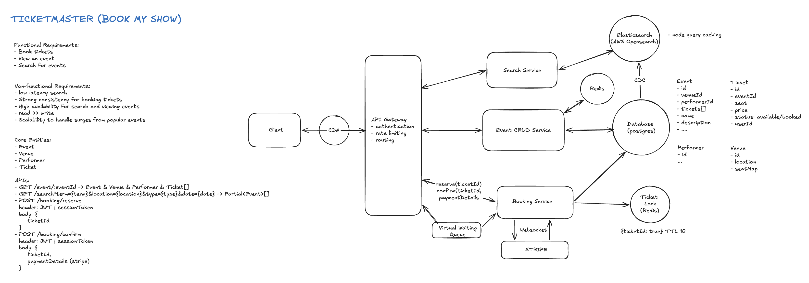
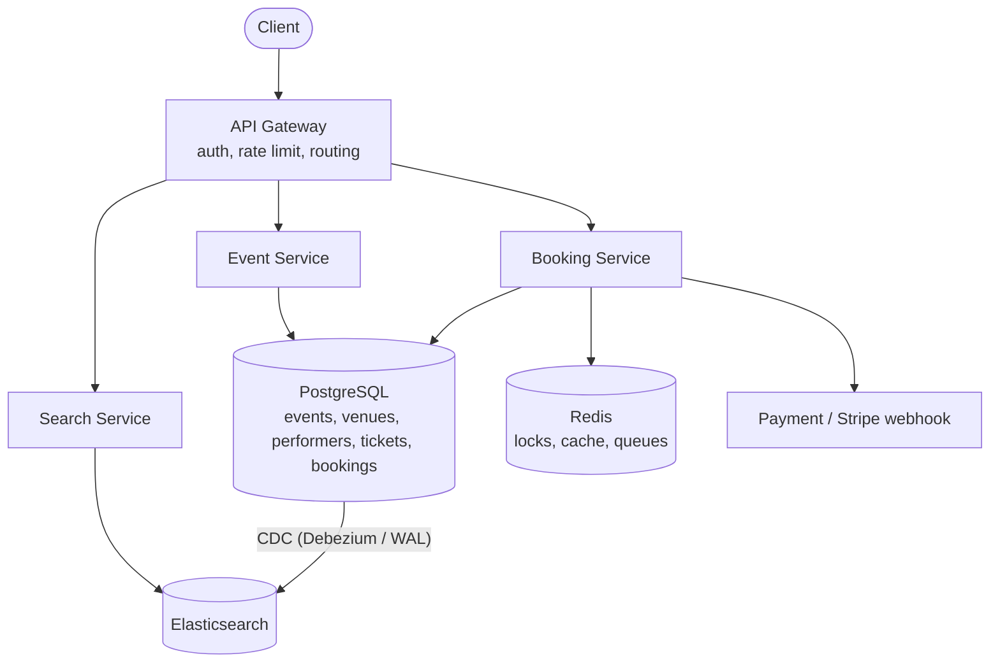
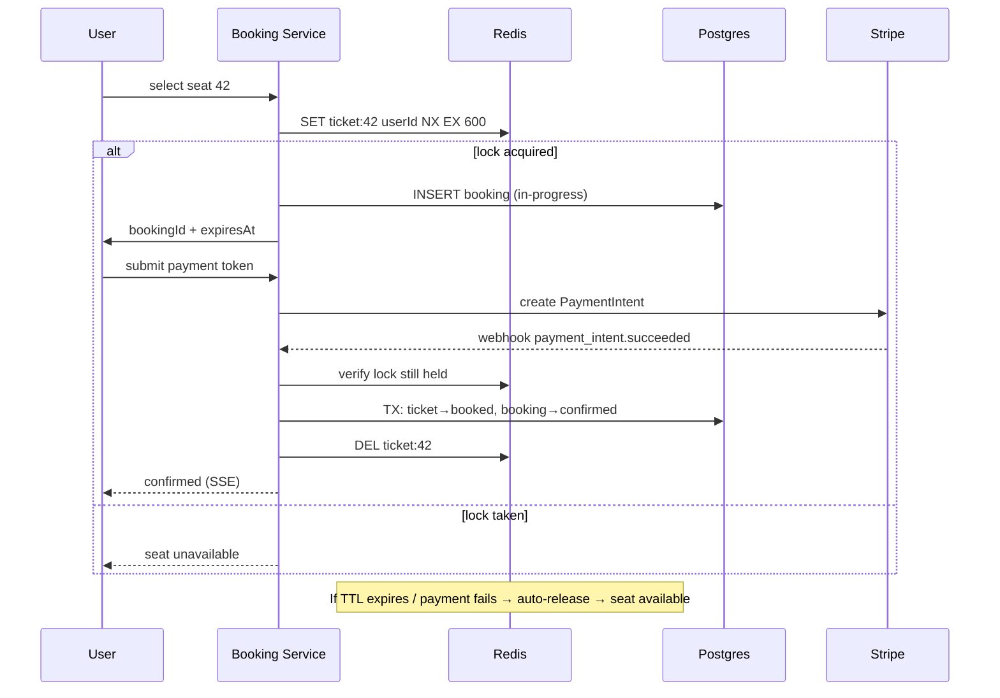
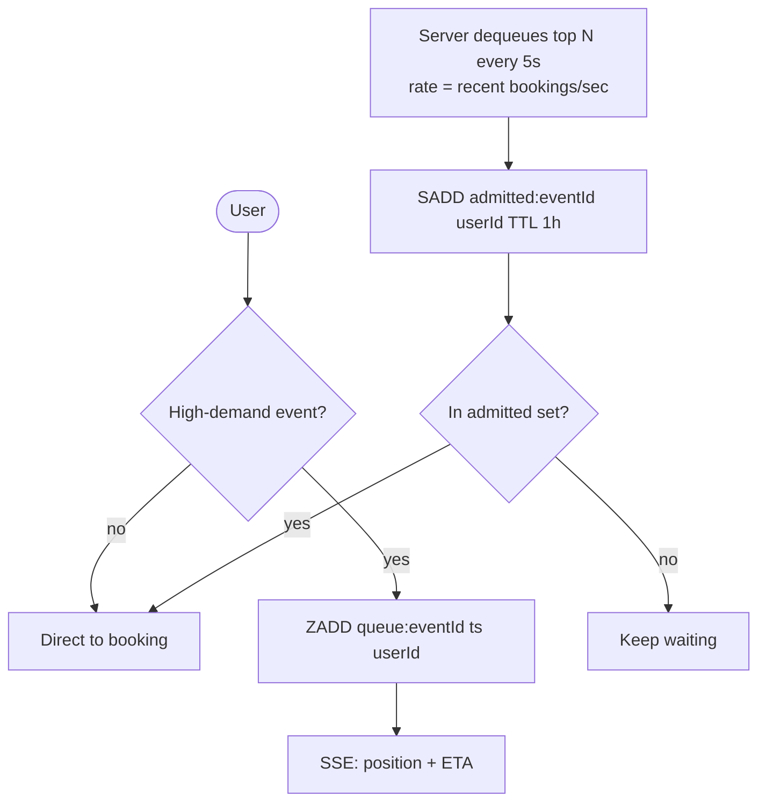

# Designing Ticketmaster (Event Ticketing) — Interview Notes

> Self-contained cheat sheet for a system design interview. Everything you need is here — source: [Hello Interview – Ticketmaster](https://www.hellointerview.com/learn/system-design/problem-breakdowns/ticketmaster).

---

## 0. The 30-second pitch

Ticketmaster lets users **browse events, search them, and book seats without double-booking**. Two forces pull in opposite directions: **viewing/searching is read-heavy (100:1)** and wants **availability** (cache everything, Elasticsearch, CDN), while **booking is correctness-critical** and wants **strong consistency** (no two people get seat 42). The signature problems: (1) **reserve a seat during a 5–10 min checkout without holding a DB lock that whole time** → **Redis distributed lock with a 10-min TTL**; (2) the **"Taylor Swift" thundering herd** of 10M concurrent users → a **virtual waiting queue**; (3) fast fuzzy **search** → **Elasticsearch fed by CDC**.

---

## 1. Requirements

### Functional
1. **View** an event (details + seat map).
2. **Search** events by keyword, date, location.
3. **Book** tickets — *without double-booking*.

**Out of scope:** booking history, admin event creation, dynamic pricing.

### Non-Functional
| Requirement | Target | Why |
|---|---|---|
| **Mixed consistency** | **Availability for view/search; strong consistency for booking** | Browsing can be slightly stale; a seat sold twice is unacceptable |
| **Scale** | **10M concurrent users** on one hot event | The Taylor Swift problem drives the queue design |
| **Search latency** | **< 500ms** | Search must feel instant |
| **Read:write** | **100:1** | Reads dominate → cache + replicas |

> **Framing insight:** treat the **read plane** (view/search — cache, ES, CDN, eventual consistency) and the **write plane** (booking — ACID, Redis locks) as two separate systems glued by shared entities.

---

## 2. Core Entities

| Entity | Meaning |
|---|---|
| **Event** | name, date, description, type; FK to performer + venue |
| **Venue** | address, capacity, **seat map (JSONB)** |
| **Performer** | artist/team; name, bio |
| **Ticket** | one physical seat: `event_id, section, row, seat_number, price, status (available/reserved/booked)` |
| **Booking** | groups a **multi-ticket purchase** under one transaction: `user_id, ticket_ids[], total_price, status, payment_intent_id` |

> **Key decision:** a separate **Booking** entity groups several tickets under one payment/status, instead of tracking payment per ticket.

---

## 3. API Design

```
GET /events/:eventId          → Event + Venue + Performer + Ticket[]
GET /events/search?keyword=&start=&end=&page=   → Event[]
POST /bookings/:eventId  { ticketIds:[], paymentDetails }  → bookingId
POST /bookings/:bookingId/confirm { paymentToken }         → status
GET /events/:eventId/seat-updates   (SSE stream of seat status changes)
```

---

## 4. High-Level Architecture





- **Event Service** → Postgres (+ Redis cache) for event/venue/performer/seat map.
- **Search Service** → Elasticsearch, kept in sync from Postgres via **Change Data Capture**.
- **Booking Service** → Postgres (ACID) + Redis (reservation locks) + Stripe.

---

## 5. Deep Dive 1 — Preventing Double-Booking ⭐ the crux

**Problem:** a user spends 5–10 min on the payment form; you must hold their seat that whole time, then confirm on payment — without two users ever booking the same seat.

### The ladder of solutions

| # | Approach | Verdict | Why |
|---|---|---|---|
| 1 | **`SELECT … FOR UPDATE`** DB row lock held through checkout | ❌ Bad | Locks are for ms-transactions, not 10-min checkouts → contention, deadlocks, orphaned locks on crash |
| 2 | **Status field + cron** (`reserved`→`available` when expired) | 🟡 Good | Simple, but lag between expiry and cron; if cron dies, seats stuck forever; multi-cron races |
| 3 | **Status + implicit expiration** (`available OR (reserved AND expiry<NOW)`) | 🟢 Great | Short atomic txns, self-cleaning; but every read checks two conditions + needs compound index |
| 4 | **Redis distributed lock + TTL** | ⭐ Excellent | Fast in-memory, auto-expiring, scales to millions |

### ⭐ Solution 4 — Redis lock with TTL

```
# Atomic: only succeeds if the key doesn't already exist
SET ticket:123 <userId> NX EX 600      # 600s = 10-min hold
```
- **Success** → create a `Booking` (status `in-progress`), return `bookingId`.
- **Fail** → seat already held by someone else.
- User fills payment form → posts token + bookingId → server creates a **Stripe PaymentIntent**.
- **Stripe webhook on success:** verify the user still holds the Redis lock → **DB transaction**: `tickets → booked`, `booking → confirmed` → **DELETE the Redis key**.
- **If TTL expires before payment / payment fails:** Redis auto-releases → seat available again. No cron needed.



**Multi-ticket atomicity:** acquire all locks or none. If tickets hash to the same Redis node, use a **Lua script**: try `SET NX` for each; on any failure, release all acquired locks and fail the booking.

**Showing reserved seats as unavailable (seat map):**
- **Option A — Redis sorted set:** `ZADD event:123:reserved <expiresAt> ticketId`; reads only count future-dated entries; lazily trim with `ZREMRANGEBYSCORE`. ✅ expires naturally; ❌ extra Redis round-trip per seat-map view.
- **Option B — write-through:** write `status=reserved` to DB on lock acquire (Redis TTL still the source of truth for expiry; periodic sweep cleans stale rows). ✅ simple reads; ❌ more DB writes.

**Failure handling (Redis down):** fall back to **Optimistic Concurrency Control** in Postgres — users proceed without a reservation and one loses *after* payment (auto-refund). Graceful degradation beats "all seats locked."

**Edge case — TTL expires at 10:00, payment lands at 10:01:** OCC detects the conflict, fails one booking, auto-refunds. **Prevent** by generous TTL (10+ min) and **extending TTL when payment is initiated**.

> **Idempotency:** `bookings.payment_intent_id` is `UNIQUE` so a re-delivered Stripe webhook can't double-process.

---

## 6. Deep Dive 2 — Virtual Waiting Queue (the Taylor Swift problem)

**Problem:** 10M users hit the page at once; the seat map empties in seconds; everyone has a terrible time and the booking service melts.

**Solution — Redis-backed virtual queue:**
```
On booking-page request:
  is event high-demand? (admin flag or >threshold concurrent)
  if yes:
    ZADD queue:eventId <timestamp> userId     # sorted set, FIFO by time
    return position + estimated wait
    open SSE connection for live position updates

Server dequeues in batches:
  ZRANGE queue:eventId 0 9                     # top 10 every ~5s
  SADD admitted:eventId userId  (TTL 1h)       # separate admitted set
  SSE → "you're admitted"

Booking Service gate:
  is userId in admitted:eventId? → proceed, else reject
```

- **Dequeue rate = adaptive:** watch tickets-booked-per-second over the last 60s and admit batches to match, preventing a thundering herd when the gate opens.
- **SSE (server→client only)** is simpler than WebSocket for pushing position updates.



---

## 7. Deep Dive 3 — Fast Search

**Problem:** `WHERE name LIKE '%Taylor%'` = full table scan, and partial/typo matches are slow.

| Solution | Verdict |
|---|---|
| B-tree indexes on `name`/`location` | Basic — partial matches still slow; slows writes |
| **Postgres full-text** (`GIN` + `to_tsvector`/`plainto_tsquery`) | Good — real FTS, more storage/maintenance |
| **Elasticsearch** | ⭐ Excellent — inverted index, **fuzzy/typo tolerance**, relevance scoring, ~**50–100ms** on millions of events |

**ES sync:** **CDC** — Debezium / Postgres logical decoding tails the **WAL** and streams changes to Elasticsearch. Query with `multi_match` over `name^2, description, performer.name` + `"fuzziness": "AUTO"` ("Tayler" → "Taylor").
**Trade-off:** **1–5s index lag** (eventual consistency) and extra infra — fine for search.

---

## 8. Deep Dive 4 — Scaling Reads (view pages get hammered on-sale)

Multi-layer caching:
1. **App cache (Redis):** static event/performer/venue data, **24h TTL**, read-through, invalidated by DB triggers. Seat map **can't** be fully cached (changes per second) → DB query + Redis lock overlay.
2. **CDN edge (CloudFront):** cache **non-personalized** search results by query params, **1–5 min TTL**, for popular recurring searches.
3. **Elasticsearch query cache:** shard-level filter + request caches; adaptive caching of hot queries.

---

## 9. Deep Dive 5 — Real-Time Seat Map Updates

As seats sell, the map goes stale. Options:
- **SSE push** per status change — great at moderate load; a "blizzard" of updates during a Taylor Swift rush.
- **Optimistic local updates** — gray out the user's own click instantly; re-enable if the server rejects.
- **Batched updates** — publish changes every ~500ms–2s (Kafka/Redis pub-sub) and let clients poll `?since=<ts>` instead of streaming every single seat change.

**Combined strategy for hot events:** queued users never see the seat map; **admitted** users get **batched** updates every 1–2s (not per-ticket) → fresh enough, no blizzard.

---

## 10. Scaling Writes During Booking

| Approach | Pro | Con |
|---|---|---|
| **Write sharding** by `eventId`/`userId` | parallelizes writes | cross-shard queries + rebalancing hard |
| **Event-specific DB** (dedicated Postgres per hot event) | isolates the hotspot | ops overhead; must predict hot events |
| **Write buffer + async** (enqueue to Redis, confirm via SSE) | fast response, decouples load | at-least-once (dup risk), 1–5s latency |

---

## 11. Data Model (key bits)

```sql
tickets(
  id PK, event_id FK, section, row, seat_number, price,
  status,                          -- available | reserved | booked
  UNIQUE(event_id, section, row, seat_number)
);
CREATE INDEX idx_tickets_availability ON tickets(event_id, status) WHERE status != 'booked';

bookings(
  id PK, user_id, event_id FK, ticket_ids UUID[], total_price,
  status,                          -- in-progress | confirmed | cancelled
  payment_intent_id,
  UNIQUE(payment_intent_id)        -- idempotent Stripe webhook processing
);
venues( id PK, name, address, capacity, seat_map JSONB );
```

---

## 12. Consistency Model (say this table out loud)

| Operation | Mechanism | Consistency | Trade-off |
|---|---|---|---|
| **Book** | Postgres TX + OCC | **Strong (ACID)** | ~200–500ms |
| **Reserve** | Redis TTL lock | Eventual (expiry) | ~10ms, auto-release |
| **View event** | Cache + TTL | Eventual (up to 24h) | High availability |
| **Search** | Elasticsearch + CDC | Eventual (1–5s) | <500ms latency |
| **Seat map** | DB + Redis overlay | Eventual (~0.5–1s) | Real-time feel |

**Strong consistency only where it must be — booking. Everything else is eventual, for availability + speed.**

---

## 13. Key Numbers

| Metric | Value |
|---|---|
| Concurrent users (one event) | 10M |
| Read:write | 100:1 |
| Search latency (p95) | < 500ms (ES ~50–100ms) |
| Reservation TTL | **600s (10 min)** |
| Admitted-set TTL | 1h |
| Event cache TTL | 24h; CDN search 1–5 min |
| ES sync lag | 1–5s |
| Storage | tickets ~5TB, bookings ~1TB → ~7TB total |
| Redis memory | ~3GB (locks + queue + cache) |

---

## 14. Rapid-fire Q&A

- **Q: How hold a seat for a 10-min checkout without a DB lock?** → Redis `SET ticket:id user NX EX 600`; confirm on Stripe webhook; TTL auto-releases.
- **Q: Why not `SELECT FOR UPDATE`?** → Locks are for ms transactions; a 10-min hold → contention, deadlocks, orphaned locks on crash.
- **Q: Multi-seat booking atomicity?** → Lua script: acquire all `SET NX` locks or release all and fail.
- **Q: What if Redis dies?** → Fall back to Postgres OCC; one booking loses post-payment (auto-refund). Graceful degradation.
- **Q: TTL expires mid-payment?** → OCC catches the conflict + refund; prevent with generous TTL + extend on payment start.
- **Q: Duplicate Stripe webhooks?** → `UNIQUE(payment_intent_id)` makes confirmation idempotent.
- **Q: 10M users at once?** → Virtual waiting queue (Redis sorted set) + SSE position updates + adaptive dequeue rate.
- **Q: Fast fuzzy search?** → Elasticsearch (inverted index, `fuzziness: AUTO`), synced from Postgres via CDC (~1–5s lag).
- **Q: Event pages hammered on-sale?** → App cache (24h) + CDN (1–5 min) + ES query cache; seat map stays dynamic.
- **Q: Seat map update blizzard?** → Batch updates every 1–2s over SSE, not per-ticket; optimistic local updates for the user's own clicks.
- **Q: Booking write bottleneck?** → Shard by event, dedicated DB per hot event, or async write buffer.

---

## 15. What each level is expected to cover

- **Mid-level:** API + data model; view/search/book paths; name caching + transactions.
- **Senior:** deeply optimize the critical path — Redis lock strategy, ES + CDC, cache layers — and articulate the consistency trade-offs.
- **Staff+:** proactively surface the 10M-concurrent bottleneck; design the virtual queue; go 2–3 deep dives with "I've built this" specificity.

---

### TL;DR walk-in order
1. Requirements → **availability for view/search, strong consistency for booking.**
2. Entities (Ticket vs Booking) + API.
3. High-level design (Event / Search / Booking services; Postgres + Redis + Elasticsearch).
4. Deep dive: **double-booking** — ladder to **Redis TTL lock**, webhook confirm, OCC fallback, idempotency.
5. Deep dive: **virtual waiting queue** for 10M users (sorted set + SSE + adaptive dequeue).
6. Deep dive: **search** — Elasticsearch + CDC.
7. Deep dive: **scaling reads** — multi-layer cache; **seat-map** real-time updates (batched SSE).
8. Close with the **consistency model** table.
