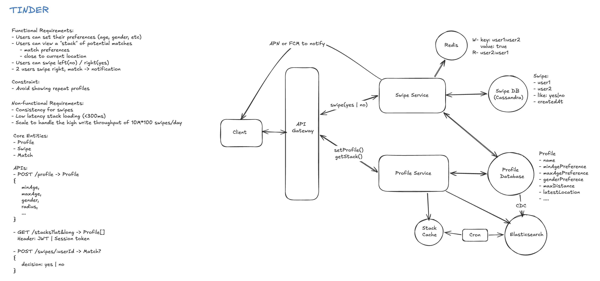
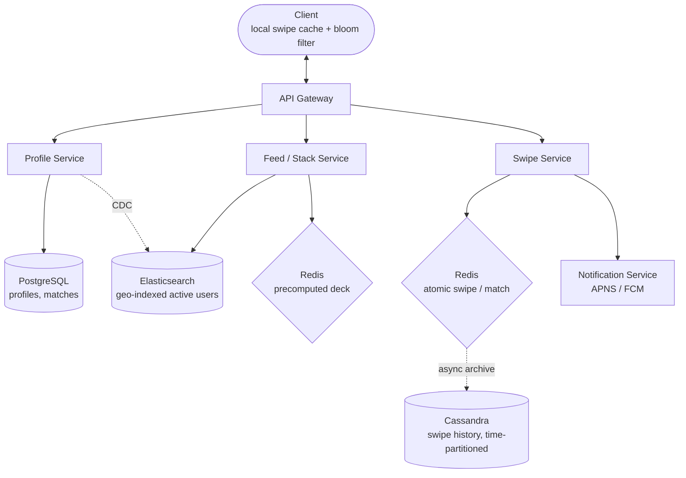

# Designing Tinder (Dating App) — Interview Notes

> Self-contained cheat sheet for a system design interview. Everything you need is here — source: [Hello Interview – Tinder](https://www.hellointerview.com/learn/system-design/problem-breakdowns/tinder).

---

## 0. The 30-second pitch

Tinder shows you a **stack of nearby profiles matching your preferences**, you **swipe** left/right, and when **two people both swipe right you get a match**. Three problems dominate: (1) **geospatial feed** — query 20M users by location + age/interest filters in <300ms (→ **geohash / Elasticsearch geo**); (2) **mutual-match detection** — a race-condition-free "did the other person already swipe right?" check (→ **same-partition atomic op**, Redis Lua or Cassandra LWT); (3) **never re-show a swiped profile** across 2B swipes/day (→ **Bloom filter**). Reads are served from a **precomputed deck** cached in Redis.

---

## 1. Requirements

### Functional
1. Create a **profile** with preferences (age range, interested-in) and **max distance**.
2. View a **stack** of candidate profiles filtered by preference + location.
3. **Swipe** right (like) / left (pass), sequentially.
4. **Mutual swipe → match** + notification.

**Out of scope:** image uploads, chat/DMs, premium features.

### Non-Functional
| Requirement | Target | Why |
|---|---|---|
| **Strong consistency on swiping** | Mutual swipes **must** create a match, reliably | The core product promise; a missed match is a broken app |
| **Scale** | **20M DAU × ~100 swipes = 2B swipes/day** (~23K/s avg, ~50K/s peak) | Drives write-storage + dedup design |
| **Feed latency** | **< 300ms** | Swiping must feel instant |
| **No re-shows** | Never show an already-swiped profile | Otherwise the deck feels broken |

> **Framing insight:** the **feed** tolerates eventual consistency (a slightly stale candidate is fine), but **match detection** demands strong consistency (both-right must always fire). Two very different guarantees in one app.

---

## 2. Core Entities

| Entity | Meaning |
|---|---|
| **User/Profile** | demographics (age, gender), preferences (`age_min/max, interested_in`), `location (lat,long)`, `max_distance` |
| **Swipe** | `{ swiping_user_id, target_user_id, direction (yes/no), timestamp }` |
| **Match** | created when **both** users swipe yes; triggers push notification |
| **Location** | user's current coordinates — updated often, drives feed filtering |

---

## 3. API Design

```
POST /profile   { age_min, age_max, distance, interestedIn, current_location:{lat,long} }
GET  /feed?lat={}&long={}&distance={}     → User[]  (stack of ~50–100 profiles)
POST /swipe/{userId}   { decision: "yes" | "no" }   → { matched: bool, match_id? }
```
All endpoints authenticated (JWT).

---

## 4. High-Level Architecture





- **Profile Service** → PostgreSQL (relational user data); changes flow to Elasticsearch via **CDC**.
- **Feed/Stack Service** → Elasticsearch geo query + Redis precomputed deck.
- **Swipe Service** → Redis atomic match check + async Cassandra archive + notifications.

---

## 5. Deep Dive 1 — Geospatial Feed (find nearby, filtered profiles)

**The problem:** `WHERE age BETWEEN … AND lat BETWEEN … AND long BETWEEN …` over 20M users doesn't use spatial indexing well — slow.

| Solution | Notes | Verdict |
|---|---|---|
| **Elasticsearch geo** (`geo_point` + `geo_distance`) | BKD-tree spatial index, O(log N); combines age/interest filters **and** distance in one query | ⭐ Recommended |
| **Redis GEO** (`GEOADD` / `GEORADIUS`) | Sub-ms, dead simple | 🟡 But can't combine with age/pref filters — needs app-side filtering; memory-heavy for 20M |
| **Geohashing / quadtree** | Encode lat/long → grid cell; query the user's cell + 8 neighbors, then filter | ⭐⭐ Naturally partitionable, cuts query scope 90%+, works on any backend |

**Geohash mechanics:** a geohash string encodes a lat/long into a grid cell (longer string = finer cell). A user's candidates live in their **current cell + the 8 neighboring cells** within `max_distance`. Query only those partitions, then filter by age/preference.
- **Edge case:** two people just across a cell boundary get different hashes → always query neighbors, not just the one cell.
- **Trade-off:** must recompute a user's cell as they move; manual cache invalidation.

**ES trade-off:** eventual consistency vs PostgreSQL (needs CDC / resync); frequent location updates can lag.

---

## 6. Deep Dive 2 — Deck Precomputation & Caching (<300ms feel)

Querying Elasticsearch on every app-open is slow. **Precompute + real-time fallback:**

**Phase 1 — background precompute (every ~1h for active users):**
```
for each active user:
  candidates = ES.geo_query(location, max_distance, prefs)
  filtered   = remove_seen(candidates, user_id)   # bloom filter, deep dive 4
  redis["deck:"+user_id] = filtered[0:100]  (TTL ~1h)
```
Footprint: 20M × 100 IDs × ~100B ≈ **~200GB Redis** (fine on a cluster).

**Phase 2 — client consumption:** app fetches deck (~50); when ~10 left, client pings backend to refresh; backend fetches 50 more from ES **in parallel** (doesn't block swiping).

**Phase 3 — real-time fallback:** on cache miss / exhausted deck, live ES query (~300ms worst case, acceptable).

**Stale-deck risk:** a cached candidate may have moved away, changed prefs, or gone inactive. Mitigate: TTL <1h; **refresh on significant location change (>1km) or preference update**; background reconciliation marks stale entries; accept a small stale %.

Tunables: precompute frequency, deck size (50/100/200), "active user" definition, TTL.

---

## 7. Deep Dive 3 — Swipe Recording & Match Detection ⭐ the crux

**Race condition:** A swipes right on B (no inverse yet) and B swipes right on A (no inverse yet) *nearly simultaneously* → both checks miss → **match lost**.

**Key insight:** make **both directions of a pair land in the same partition** so the check-and-set is atomic. Build a canonical key:
```
user_pair = min(a,b) + ":" + max(a,b)   # (123→456) and (456→123) → same key
```

### Solution A — Cassandra single-partition + LWT
Partition by `user_pair`; on each swipe, `INSERT` your swipe **and** `SELECT` the inverse swipe atomically in one batch. If the inverse is already `yes` → match.
- ✅ Strong consistency in-partition, durable, scales to billions.
- ❌ LWT (Paxos) adds ~10–50ms; hot partitions for very active users; partitions grow (cleanup needed).

### Solution B — Redis atomic Lua (better latency) ⭐
```lua
-- key = "swipes:{min}:{max}"
redis.call('HSET', key, from_field, direction)
local other = redis.call('HGET', key, to_field)
if direction == 'right' and other == 'right' then return 'MATCH' else return 'NO_MATCH' end
```
- ✅ Sub-ms, truly atomic on a single node, no quorum delay.
- ❌ Volatile (lost on node failure), limited history in memory.

### ⭐ Hybrid (what to recommend)
1. **Redis Lua** for recent swipes (<1 day) → instant match detection (<5ms) for 99% of cases.
2. **Async write to Cassandra** for durable long-term archive.
3. **Failover:** if Redis dies, fall back to Cassandra LWT (slower but reliable); replay Redis→Cassandra on recovery.

```mermaid
sequenceDiagram
    participant B as User B swipes right on A
    participant SS as Swipe Service
    participant R as Redis (Lua, key=min:max)
    participant C as Cassandra
    participant N as Notifications

    B->>SS: POST /swipe/A {yes}
    SS->>R: HSET pair B=right; HGET A
    alt A already right
        R-->>SS: MATCH
        SS->>C: async archive swipe + create match
        SS->>N: push to A and B
        SS-->>B: { matched: true }
    else A not yet / left
        R-->>SS: NO_MATCH
        SS->>C: async archive swipe
        SS-->>B: { matched: false }
    end
```

---

## 8. Deep Dive 4 — Never Re-Show a Swiped Profile

At 2B swipes/day, a naive "have I swiped this?" set-lookup gets huge.

| Solution | Notes |
|---|---|
| **Client-side cache** (recent ~100–1000 in localStorage) | Instant, zero server cost; but lost on reinstall + misses long histories |
| **Bloom filter** ⭐ | Per-user probabilistic set: **no false negatives** (never wrongly says "unseen" for a swiped profile), ~1–2% false positives (rarely hides an unseen profile). Compact (2–10× smaller than an ID set), 3 hash ops per check. Rebuild periodically from Cassandra; cache in Redis w/ TTL |
| **Recent-in-Redis + accept small miss** | Filter against recent swipes in Redis; tolerate ~5–10% duplicate risk for older ones instead of paying Cassandra latency |

**Bloom filter is the headline answer:** it guarantees you never re-show a swiped profile (the important direction), at the cost of occasionally hiding a fresh one — an excellent trade for a swipe deck.

---

## 9. Deep Dive 5 — Scaling Writes (2B swipes/day)

**Estimate:** 20M × 100 = **2B/day ≈ 23K/s avg, ~50K/s peak**; ~100B/swipe → **~200GB/day**, ~73TB/yr before retention.

**Cassandra time-series partitioning** — partition by `(date, user_pair)`:
- Writes spread across date partitions → **no hot partition**.
- Each partition ~5–10GB/day → manageable compaction.
- Old partitions archived/dropped by **retention policy**.
- Cassandra handles 50K writes/s with 3-node replication easily.

**Alternative:** swipes → **Kafka** (buffer) → consumer batches into a time-series DB (ClickHouse/Timescale) for analytics, with Redis still doing real-time match detection. Decouples write ingestion from match detection.

---

## 10. Deep Dive 6 — Matches & Notifications

**Guarantee:** both-swipe-right → notification **100% of the time.**
- **Primary (real-time):** Redis Lua confirms mutual swipe → create match record → APNS/FCM push to both.
- **Fallback (reconciliation):** a batch job every ~5 min scans Cassandra for new swipes, catches any missed matches, sends notifications.
- **Notification service:** look up device tokens, send via APNS (iOS) / FCM (Android); on offline/error, enqueue a retry. Track `notification_sent_a/b` on the match row.

---

## 11. Data Model

```sql
-- PostgreSQL: profiles + matches (relational, source of truth for users)
users(id PK, age, gender, interested_in, age_pref_min, age_pref_max,
      distance_pref, lat, long, last_location_update, ...)
matches(id PK, user_a_id, user_b_id, created_at,
        notification_sent_a bool, notification_sent_b bool)

-- Cassandra: swipe archive, time + pair partitioned
swipes(
  PRIMARY KEY ((date, user_pair), from_user, to_user, created_at)
)  -- direction 'yes'|'no'

-- Elasticsearch: active users, geo-indexed
{ user_id, age, gender, location: geo_point, interested_in, active }

-- Redis
swipes:{a}:{b}   → hash of both users' swipes (atomic match)
deck:{user_id}   → list of ~100 candidate IDs (TTL ~1h)
bloom:{user_id}  → serialized Bloom filter (TTL ~1h)
```

---

## 12. Trade-offs Summary

| Decision | Why chosen |
|---|---|
| **Redis** for match detection | <5ms atomic feedback — critical UX |
| **Cassandra** for swipe archive | durable, billions-scale, date-partitioned (no hot partition) |
| **Elasticsearch** for feed | fast combined geo + attribute filtering (staleness OK) |
| **Precomputed decks** | instant feed; TTL + refresh-on-move bounds staleness |
| **Bloom filter** for dedup | no false negatives; ~1% false positives acceptable |
| **Geohash** partitioning | cuts query scope ~90%, backend-agnostic |

---

## 13. Rapid-fire Q&A

- **Q: How query nearby profiles fast?** → Elasticsearch `geo_distance` (combines filters) or geohash-partitioned cells (query cell + 8 neighbors).
- **Q: Why not plain lat/long SQL range?** → Range scans don't use spatial indexes well; slow at 20M users.
- **Q: <300ms feed?** → Precomputed deck in Redis (~100 IDs, 1h TTL), background refresh, live ES fallback.
- **Q: Stale deck (moved/changed prefs)?** → Short TTL + refresh on >1km move or pref change + reconciliation.
- **Q: How detect mutual match without race conditions?** → Canonical `min:max` pair key so both swipes hit the same partition; atomic check-and-set (Redis Lua or Cassandra LWT).
- **Q: Redis loses data?** → Async archive to Cassandra; fall back to Cassandra LWT; reconciliation job catches missed matches.
- **Q: Never re-show swiped?** → Bloom filter per user (no false negatives), + client-side recent cache.
- **Q: 2B swipes/day writes?** → Cassandra partitioned by (date, user_pair); ~50K/s peak; retention to drop old partitions.
- **Q: Guarantee match notification?** → Real-time Redis path + 5-min reconciliation batch as safety net.
- **Q: Notification delivery?** → APNS/FCM by device token; retry queue for offline devices.

---

## 14. What each level is expected to cover

- **Mid (E4):** API + data model; ES geo feed; Redis/Cassandra for swipes; client-side dedup; acknowledge the consistency issue.
- **Senior (E5):** deep dive geospatial (geohash/geo_point), Redis Lua atomic match, Bloom-filter dedup, precomputed decks + staleness trade-offs, Cassandra time-series partitioning, hybrid Redis+Cassandra.
- **Staff+ (L7):** operational concerns (partition/hot-key growth), CDC sync + batching, reconciliation jobs, device-token mgmt + retries, capacity modeling (200GB/day, 50K peak QPS), multi-region geo-distributed Cassandra, cost/retention optimization.

---

### TL;DR walk-in order
1. Requirements → **strong consistency for matches, eventual OK for the feed.**
2. Entities (User, Swipe, Match) + API.
3. High-level design: Profile / Feed / Swipe services + Postgres, ES, Redis, Cassandra.
4. Deep dive: **geospatial feed** — geohash / Elasticsearch geo.
5. Deep dive: **deck precompute + cache** for <300ms.
6. Deep dive: **match detection** — canonical pair key + atomic Redis Lua (Cassandra LWT / hybrid).
7. Deep dive: **dedup** — Bloom filter.
8. Deep dive: **write scaling** — Cassandra date-partitioned; **notifications** — real-time + reconciliation.
