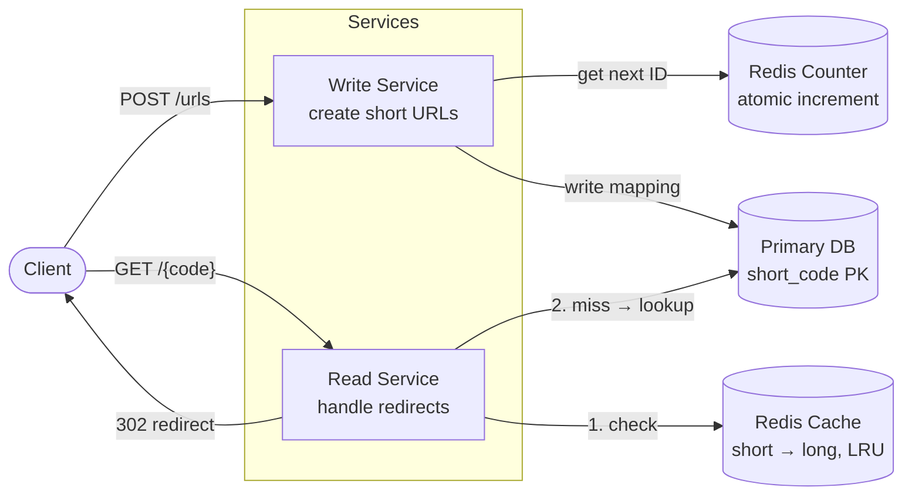
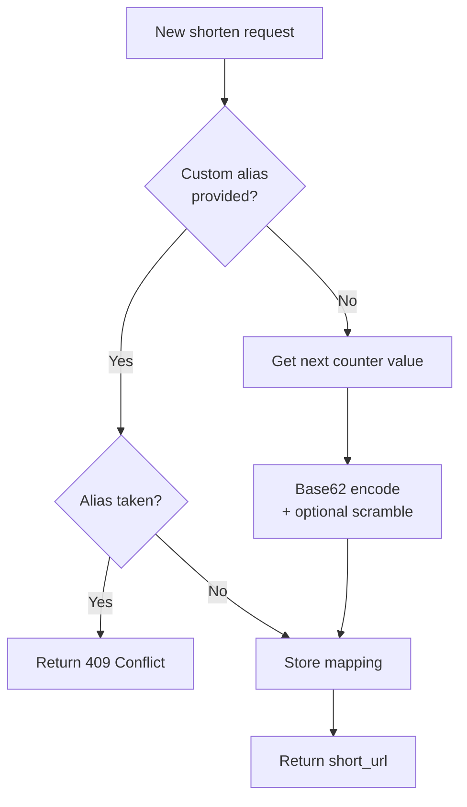
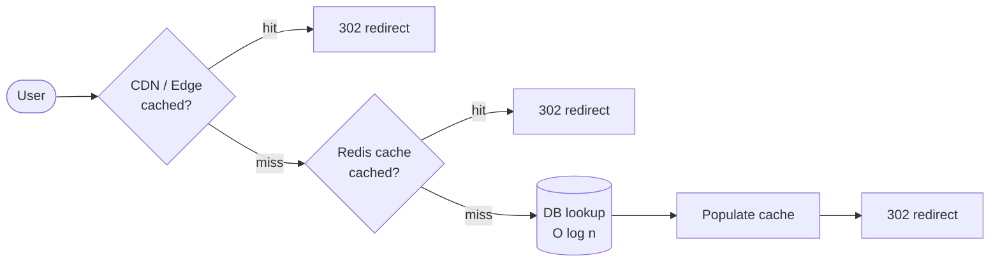
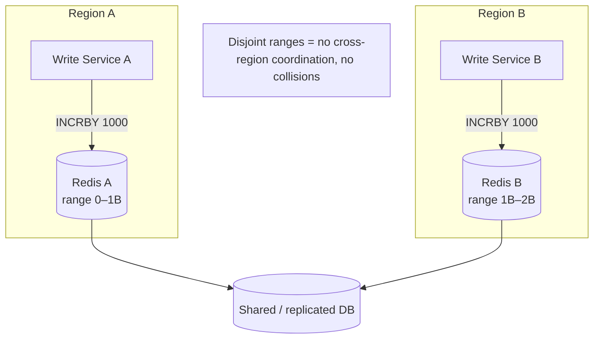
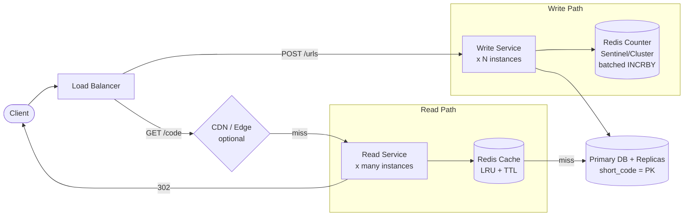

# Designing a URL Shortener (Bit.ly) — Interview Notes

> Self-contained cheat sheet for a system design interview. Everything you need is here — sources: [Hello Interview – Bitly](https://www.hellointerview.com/learn/system-design/problem-breakdowns/bitly) and the "Design Bitly w/ Ex-Meta Staff Engineer" walkthrough.

---

## 0. The 30-second pitch

A URL shortener takes a long URL (`https://example.com/some/really/long/path?x=1`) and returns a short one (`short.ly/abc123`). When someone hits the short one, you redirect them to the original. The whole problem is **generating a unique short code** and **serving redirects fast at massive read scale**. It is a *read-heavy* system (~1000 reads per write) — that fact drives almost every design decision.

---

## 1. Requirements

### Functional (what it must do)
1. **Shorten**: user submits a long URL → gets back a short URL. Optionally supports a **custom alias** and an **expiration date**.
2. **Redirect**: user visits the short URL → gets redirected to the original long URL.

**Explicitly out of scope** (say this out loud to save time): auth, analytics/click tracking, user accounts, spam/abuse detection. Mention them so the interviewer knows you *considered* them.

### Non-Functional (how well it must do it)
| Requirement | Target | Why it matters |
|---|---|---|
| **Uniqueness** | Each short code → exactly one long URL | Core correctness guarantee |
| **Latency** | Redirects < **100ms** | Users feel any delay on every click |
| **Availability** | **99.99%** uptime | Prioritize **Availability over Consistency** (AP over CP) — a redirect being a few seconds stale is fine; being *down* is not |
| **Scale** | **1B** URLs stored, **100M** DAU | Drives storage + read-throughput design |

> **The one insight that frames everything:** the workload is **heavily read-skewed — ~1000 reads per write.** Repeat this. It justifies caching, read/write separation, and "any database works for writes."

---

## 2. Core Entities

- **Original URL** — the long destination.
- **Short URL / Short Code** — the generated key (e.g. `abc123`).
- **User** — the creator (kept minimal since auth is out of scope).

---

## 3. API Design

**Create a short URL:**
```
POST /urls
Body: { "long_url": "...", "custom_alias": "...", "expiration_date": "..." }  // last two optional
Response: { "short_url": "https://short.ly/abc123" }
```

**Redirect:**
```
GET /{short_code}
Response: HTTP 302 Found, Location: <original long URL>
```

> Note we use `POST /urls` (a plural resource collection), not `POST /shorten` (a verb). REST-y resource naming reads better to interviewers.

---

## 4. High-Level Architecture



**Write path:** Client → Write Service → validate URL → generate short code (counter → base62) → store in DB.

**Read path:** Client → Read Service → check cache → (miss) DB lookup → return **302** redirect.

**Why split Read and Write services?** The read/write ratio is ~1000:1. Splitting lets you scale the Read Service horizontally (add many cheap instances) independently of the tiny Write Service. Requests are load-balanced randomly across instances of each.

---

## 5. Deep Dive 1 — How to Generate a Unique Short Code

This is the heart of the interview. Three approaches; know the trade-offs.

### Encoding: why Base62?
The short code is a number encoded into text. Use **Base62** = `[a-z, A-Z, 0-9]` (26 + 26 + 10 = 62 chars).
- **Not Base64** because Base64 adds `/` (breaks URLs — looks like a path) and `+` (interpreted as a space in query strings).

**Capacity math (memorize this):**
- `62^6 ≈ 56.8 billion` combinations → a **6-character** code comfortably covers 1B URLs (and 56× headroom).
- `62^7 ≈ 3.5 trillion` if you ever need more.

### Approach A — Hash the URL (e.g. SHA-256, take first N chars, base62)
- ✅ **Deterministic**: same long URL always → same short code (natural dedup).
- ❌ **Collisions**: truncating a hash means two different URLs can map to the same code. You must check the DB and retry with a bounded number of attempts (**3–5 retries**), which adds a read on every write.
- Verdict: workable but collision handling is annoying.

### Approach B — Counter + Base62  ⭐ **Recommended**
- Keep a single global **atomic counter**. Each new URL grabs the next integer; encode it in Base62.
- ✅ **Zero collisions by construction** — every counter value is unique, no DB check needed.
- ✅ Simple and fast.
- ❌ Codes are **sequential/predictable** → enables **enumeration attacks** (scrape `abc122`, `abc123`, `abc124`…). Mitigate by feeding the counter through a reversible scramble (e.g. a bijective function / [Feistel](https://en.wikipedia.org/wiki/Feistel_cipher)-style permutation) before base62 so codes look random but stay unique.
- ❌ Code length grows over time (fine — starts short, grows gracefully).

### Approach C — Custom alias
- User supplies the code directly (`short.ly/my-brand`). Just check it's not already taken (unique constraint on the column) and reject if it is.

### Decision flow



> **Recommendation to state:** "I'd use the **counter + Base62** approach — it guarantees uniqueness with no collision-retry logic, and I'd address predictability by scrambling the counter value before encoding."

---

## 6. Deep Dive 2 — Fast Redirects (Read Scaling → the < 100ms goal)

Reads dominate. Three layers, cheapest-latency-first:

### Layer 1 — Database index
- Make `short_code` the **primary key** (or a B-tree index on it). Lookup is **O(log n)** — fast even at 1B rows.

### Layer 2 — In-memory cache (Redis / Memcached)
- Cache hot `short_code → long_url` mappings. A small % of links get most of the traffic (power law), so hit rate is high.
- **Eviction: LRU** (Least Recently Used).
- **Invalidation gotcha:** expired URLs. Set the cache **TTL to match the URL's expiration** so stale entries die on their own.

**Latency / throughput reference (know these orders of magnitude):**
| Medium | Latency | Throughput |
|---|---|---|
| Memory (RAM) | ~100 ns | millions of reads/sec |
| SSD | ~0.1 ms | ~100k IOPS |
| HDD | ~10 ms | slow |

### Layer 3 — CDN / Edge compute (optional, for global latency)
- Serve the redirect from CDN Points-of-Presence near the user (Cloudflare Workers, AWS Lambda@Edge). The redirect can resolve **at the edge without hitting the origin**.
- ❌ Trade-off: more cost, more complexity, edge execution limits.



### 301 vs 302 — a classic interview question
| | **301 Permanent** | **302 Found (temporary)** ⭐ |
|---|---|---|
| Browser caches it? | **Yes** — future clicks skip your server | **No** — every click hits your server |
| Pro | Less load, faster for repeat visits | Keeps **control** — can update destination, do analytics, enforce expiry |
| Con | Can't change target; **no click tracking** | More load on your servers |

> **Use 302.** You keep control of the redirect (needed for expiration, future analytics, changing the target). 301 hands control to the browser cache and you lose all visibility. (If pure performance were the only goal and links never changed, 301 would win — say that to show you understand the trade-off.)

---

## 7. Deep Dive 3 — Scaling to 1B URLs & 100M DAU

### Capacity Estimation (do this on the whiteboard)

**Storage:**
- Per row: short code (~8B) + long URL (~100B) + timestamp (8B) + alias (~100B) + expiration (8B) ≈ **~200B**, round up to **~500B** with metadata/overhead.
- `1B URLs × 500B = ~500 GB`. **Fits on a single modern SSD** → storage is a non-issue.

**Throughput:**
- **Writes:** ~100k new URLs/day ≈ **~1 write/sec**. Trivially small.
- **Reads:** `100M DAU × 5 redirects/day = 500M/day ≈ 5,787 reads/sec` average.
- **Peak (100× spike):** **~600k reads/sec.** This is what you design the read path + cache for.

### Database choice
Because writes are ~1/sec and reads are cache-served, **"almost any database works."** Pick for **availability**, not throughput: **PostgreSQL / MySQL / DynamoDB** are all fine. State: "The bottleneck is availability and read latency, not write throughput, so I'll pick a proven, highly-available store like Postgres with read replicas."

### High Availability

**Counter must not be a single point of failure:**
- Use **Redis Sentinel** or **Redis Cluster** with automatic failover. A single Redis instance already does 100k+ ops/sec — plenty for ~1 write/sec.
- **Counter batching** (key optimization): each Write Service instance requests a **batch of 1000** counter values at once. Redis atomically does `INCRBY 1000` and returns the start; the service hands out those 1000 locally without touching Redis again. Cuts Redis round-trips ~1000×.
- **Multi-region:** give each region a **disjoint counter range** (Region A: `0–1B`, Region B: `1B–2B`) so regions never collide and never need to coordinate.



**Database replication:** keep multiple replicas across servers for failover + read scaling. Adds operational complexity but buys availability (the thing we optimize for).

---

## 8. Final Architecture (all pieces together)



---

## 9. Rapid-fire Q&A (likely follow-ups)

- **Q: Base62 vs Base64?** → Base62 avoids `/` (breaks URL path) and `+` (means space in query strings).
- **Q: How long is the code?** → 6 chars of Base62 = 56B combos, covers 1B with room to spare.
- **Q: Counter vs hash?** → Counter = no collisions, simple; hash = deterministic dedup but needs collision retries. Prefer counter (+ scramble for unpredictability).
- **Q: 301 or 302?** → 302, to keep server-side control for expiry/analytics/updates.
- **Q: How do you hit < 100ms?** → LRU cache in RAM (~100ns) fronting a PK-indexed DB; CDN/edge for global users.
- **Q: How do you avoid the counter being a SPOF?** → Redis Sentinel/Cluster failover + counter batching + per-region disjoint ranges.
- **Q: Which DB?** → Any (Postgres/MySQL/DynamoDB); writes are ~1/sec, so choose for availability + read replicas, not write throughput.
- **Q: How to handle expiration?** → Store `expiration_date`; a background job (or lazy check on read) purges expired rows; cache TTL matches expiry.
- **Q: Custom alias collision?** → Unique constraint on the column; reject with 409 if taken.

---

## 10. What each level is expected to cover

- **Mid-level:** working high-level design; understand unique code generation + DB indexing; know caching helps.
- **Senior:** proactively surface challenges; explain hash vs counter trade-offs; discuss cache invalidation; justify DB choice; separate read/write services.
- **Staff+:** multi-region deployment; counter failover implications; security of predictable codes; operational/maintenance planning; how the product evolves (analytics, abuse, etc.).

---

### TL;DR walk-in order for the interview
1. Requirements (functional + non-functional) → **call out read:write ≈ 1000:1**.
2. Core entities + API (`POST /urls`, `GET /{code}` → 302).
3. High-level design (split read/write services).
4. Deep dive: **counter + Base62** code generation (capacity: 6 chars, 56B).
5. Deep dive: **fast reads** — LRU cache → indexed DB → CDN; **302 not 301**.
6. Deep dive: **scale** — 500GB storage, ~600k peak reads/sec, HA counter (batching + failover + region ranges), DB replicas.
