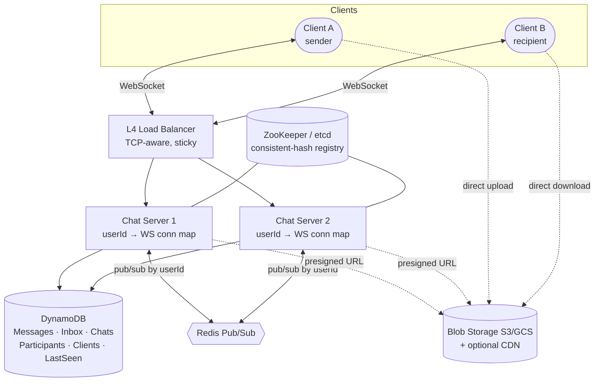
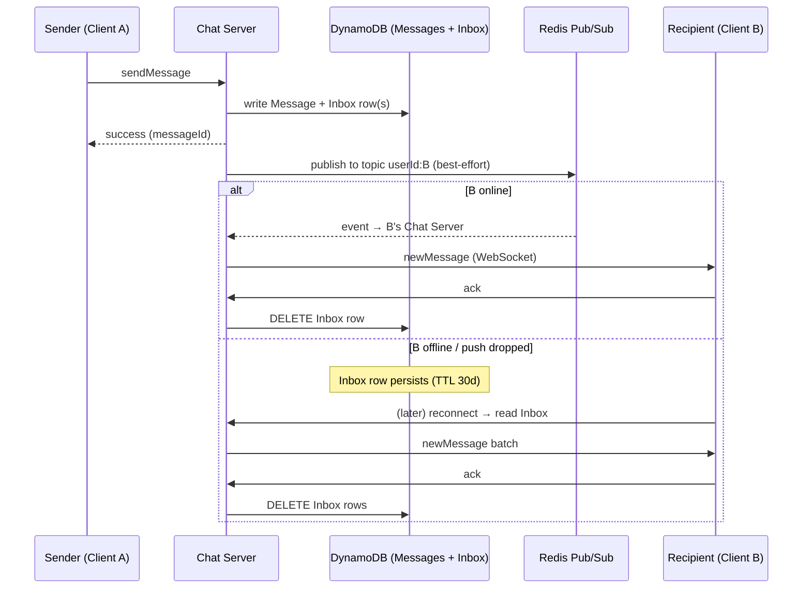
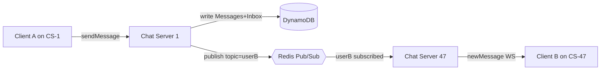

# Designing WhatsApp (Real-Time Chat) — Interview Notes

> Self-contained cheat sheet for a system design interview. Everything you need is here — sources: [Hello Interview – WhatsApp](https://www.hellointerview.com/learn/system-design/problem-breakdowns/whatsapp) + [Design WhatsApp (Ex-Meta Sr Manager)](https://www.youtube.com/watch?v=cr6p0n0N-VA).

---

## 0. The 30-second pitch

WhatsApp delivers **1:1 and small-group messages in real time (<500ms)**, works when the recipient is **offline**, and keeps **minimal data on the server** (delete after delivery, 30-day cap). The design rests on three pillars: (1) **persistent WebSocket connections** so the server can *push* to clients (chat isn't request/response); (2) a **durable per-recipient Inbox** (store-and-forward) so a message is never lost if the recipient is offline or a best-effort push fails; (3) **Redis Pub/Sub keyed by userId** to bridge sender and recipient when they're connected to *different* chat servers (billions of users → hundreds of servers). Durability lives in the database (Messages + Inbox); Pub/Sub is a fast best-effort layer on top.

---

## 1. Requirements

### Functional
1. **Group chats** of 2–100 participants (1:1 is the dominant case).
2. **Send / receive messages** with real-time delivery.
3. **Offline delivery** — store messages for a recipient who's offline (up to **30 days**).
4. **Media attachments** in messages.

**Out of scope:** audio/video calls, business accounts, registration/profile management.

### Non-Functional
| Requirement | Target | Why |
|---|---|---|
| **Low latency** | **< 500ms** delivery to online users | Chat must feel instant |
| **Guaranteed delivery** | No message ever lost | Core promise — drives the durable Inbox |
| **Scale** | **Billions of users**, ~40K msgs/s (→ ~100K DB writes/s w/ fanout) | Drives multi-server + Pub/Sub |
| **Minimal retention** | Store centrally **no longer than necessary** (30-day TTL) | Privacy + storage cost |
| **Resilience** | Tolerate server/connection failure | Heartbeats, reconnect, Inbox backstop |

> **Framing insight:** two guarantees in tension — **speed** (best-effort push over Pub/Sub, accept mild reordering) and **reliability** (durable Inbox that survives crashes). The design separates them: *fast path* = Pub/Sub, *safe path* = Inbox. Say this early.

---

## 2. Core Entities

| Entity | Meaning |
|---|---|
| **User** | An account (identified by phone number). |
| **Client** | A single **device/connection** for a user (multi-device → up to 3). |
| **Chat** | A conversation (1:1 or group); has participants + metadata. |
| **ChatParticipant** | Membership edge: `chatId ↔ participantId`. |
| **Message** | One message: `chatId, messageId, senderId, text, timestamp, attachments[]`. |
| **Inbox** | Per-client queue of **undelivered** messages (store-and-forward). |

---

## 3. API Design — a WebSocket protocol (not REST)

Chat is **server-push**, so the primary transport is a **persistent WebSocket**, not request/response REST. (A few things — login, presigned media URLs — can still be plain HTTPS.)

**Client → Server:**
```
createChat            { participants[], name }         → chatId
sendMessage           { chatId, clientMsgId, text, attachments[] }  → { messageId, serverTs }
modifyChatParticipants{ chatId, userId, op: add|remove }
createAttachment / getAttachmentTarget { hash }        → presigned S3 URL
ack                   { messageId }                    (recipient confirms receipt)
getLastSeen           { userId }
```

**Server → Client:**
```
newMessage    { chatId, senderId, messageId, text, attachments[], serverTs }
chatUpdate    { chatId, participants[] }
ack           { messageId }        (delivery/read receipts)
lastSeen      { userId, status: ONLINE | <timestamp> }
```

> **Every delivered message requires an ACK** from the recipient. The ACK is what lets the server delete the Inbox entry — no ACK, no delete, so nothing is lost.

---

## 4. High-Level Architecture



**Pieces:**
- **L4 load balancer** (TCP-aware, so it doesn't break long-lived WebSockets) routes each client to a Chat Server.
- **Chat Server** holds an in-memory map `userId/clientId → WebSocket connection` for everyone connected *to it*, and subscribes to those users' Pub/Sub topics.
- **DynamoDB** — durable store: Messages, per-client Inbox, Chats, Participants, Clients, LastSeen. All message/inbox rows carry a **30-day TTL** (auto-delete).
- **Redis Pub/Sub** — lightweight fanout so a message reaches the Chat Server that holds the recipient's socket, even if it's a different server.
- **Blob storage (S3/GCS)** — media uploaded/downloaded **directly by clients** via presigned URLs; only a URL reference travels through the chat path.

---

## 5. Deep Dive 1 — Real-Time Delivery: why WebSockets ⭐

Chat is fundamentally **server-initiated**: the server must push B's incoming message to B without B asking. Compare the options:

| Transport | Verdict |
|---|---|
| **Short polling** (client asks "any new?" every Ns) | ❌ Either high latency (long interval) or crushing load (short interval). Backstop only. |
| **Long polling** | 🟡 Works, but awkward connection churn at billions scale |
| **SSE** (server→client stream) | 🟡 One-directional push; you'd still need a separate channel for sends |
| **WebSocket** (full-duplex, persistent) | ⭐ Bidirectional, low overhead per message, native push — the standard answer |

**WebSocket mechanics to mention:**
- Starts as an HTTP request with `Upgrade: websocket` → connection is "upgraded" to a persistent TCP stream; both sides push frames afterward.
- The **load balancer must be L4 (TCP)**, not L7/HTTP — an L7 LB that terminates per-request would break the long-lived socket.
- Connections are **stateful and sticky**: the socket lives on one specific Chat Server for its lifetime.

---

## 6. Deep Dive 2 — Offline Delivery: the durable Inbox (store-and-forward) ⭐ the reliability crux

**The problem:** Pub/Sub is best-effort and in-memory — if the recipient is offline, or the push is dropped, the message must still arrive. You cannot rely on the fast path for the guarantee.

**Solution — write durably *before* you push:**
```
sendMessage:
  1. Write to Messages table          (durable log of the message)
  2. Write an Inbox row per recipient client   (clientId + messageId, "undelivered")
  3. Return success + messageId to sender      ← sender is now safe
  4. Publish to Redis Pub/Sub (best-effort real-time nudge)

Recipient online:
  5. Its Chat Server gets the Pub/Sub event → pushes newMessage over WebSocket
  6. Client ACKs → server DELETEs the Inbox row

Recipient offline:
  - Steps 5–6 never happen; the Inbox row just sits there (durable, 30-day TTL)
  - On reconnect, client queries its Inbox → fetches message bodies from Messages
    → server pushes them (batched) → client ACKs → Inbox rows deleted
```



**Why this is the whole game:** durability lives in DynamoDB (Messages + Inbox); Pub/Sub is just an optimization to skip the poll when the recipient happens to be online. Lose Pub/Sub entirely and messages still get delivered — just on reconnect/poll instead of instantly.

---

## 7. Deep Dive 3 — Scaling to Billions: Pub/Sub across many servers ⭐

**Problem:** one host handles only ~**1–2M** concurrent connections (WhatsApp's real figure); 200M+ connected users → **hundreds of Chat Servers**. The sender's socket and the recipient's socket are almost always on **different servers**. How does server 1 reach a socket living on server 47?

**Solution — Redis Pub/Sub keyed by userId:**
1. **Consistent hashing** (registry in **ZooKeeper/etcd**) maps each user to a primary Chat Server; the LB routes accordingly. Consistent hashing means adding/removing a server reshuffles only ~1/N of users, not everyone.
2. On connect, the user's Chat Server **subscribes to that user's topic** in Redis (`topic = userId`).
3. On send: write durably (Messages + Inbox), then **publish to each recipient's userId topic**.
4. Whichever Chat Server holds that recipient's socket is subscribed → it receives the event → pushes over WebSocket. Offline / miss → Inbox covers it.

**Why Redis Pub/Sub, not Kafka?**
| | Kafka | Redis Pub/Sub |
|---|---|---|
| Per-topic overhead | ~50KB/topic → **50TB+** for 1B user-topics | ✅ Negligible, in-memory channels |
| Persistence | Durable (which we **don't need** — Inbox is our durability) | ✅ None; fine here |
| Throughput | High | ✅ High (a single Redis host did ~100K updates/s at 27% util in Canva's case) |
- Kafka's per-topic cost makes **a topic per user** infeasible. Redis Pub/Sub channels are cheap because we don't need persistence — the **Inbox already guarantees durability**.

**Partition by user, not by chat** — WhatsApp is dominated by 1:1 chats, so user-keyed topics fan out naturally. **Exception:** for **large chats (≥25 participants)**, publishing to every member's topic is wasteful → **adaptively subscribe Chat Servers to a chat-level topic** to cut fan-in.



---

## 8. Deep Dive 4 — Connection Robustness (detecting dead sockets)

A TCP socket can die silently (client loses signal, laptop sleeps) — the server still *thinks* it's connected and pushes into the void. Three mechanisms:

**1. Application-level heartbeats (ping/pong):**
- Server sends `ping` every **10–30s**; client must `pong` within a **~5s** timeout.
- No pong → server closes the connection and frees the map entry; client reconnects.
- **Detection upper bound ≈ 15s** (interval + timeout). (Note: application heartbeats, not just TCP keepalive, because TCP keepalive is too coarse and doesn't prove the app is alive.)

**2. Sequence numbers + gap detection:**
- Assign a **monotonic per-user sequence** (Redis `INCR`); piggyback the latest seq on heartbeat pings.
- If the client's local seq < server's seq, it **missed messages** → requests a sync from the Inbox. Fast detection, tiny overhead.

**3. Periodic polling backstop:**
- Even connected clients poll the Inbox every **30–60s** to catch anything Pub/Sub silently dropped.
- Cost: 200M users / 30s ≈ **~7M queries/s** — real, so lengthen the interval or gate it behind "did seq gap detection already cover this?".

> Layered defense: Pub/Sub (instant) → heartbeat+seq (catch drops in seconds) → poll (catch the rest in a minute) → Inbox (the ultimate durable truth).

---

## 9. Deep Dive 5 — Multi-Device Support

One account, multiple devices (phone + web + tablet). Changes from the single-device model:
- **Clients table:** `userId → [clientId...]`, capped at **3 clients** (bounds write/storage amplification).
- **Inbox becomes per-client**, not per-user (`PK = clientId + messageId`) — each device must independently receive + ACK.
- On send, resolve each recipient **user → all their active clients** and write an Inbox row per client.
- **Pub/Sub still keyed by userId**; the receiving Chat Server forwards to **all of that user's connected client sockets**.
- A message is only "gone" from a client's Inbox once **that specific client** ACKs — so your phone and laptop each get + confirm the message.

---

## 10. Deep Dive 6 — Media / Attachments

**Never push binary through the chat servers or store it in DynamoDB** (kills throughput). Use **presigned URLs + direct client transfer:**
1. Sender requests `getAttachmentTarget` → server returns a **presigned S3 URL** (scoped, expiring, write-only).
2. Client **uploads directly to S3/GCS** (chat servers never touch the bytes).
3. `sendMessage` carries only the **opaque URL reference** (tiny).
4. Recipients **download directly** via presigned (read) URLs; optional **CDN** in front (limited benefit for ≤100-person chats, but standard for media).
5. Media also carries a **30-day TTL** (auto-expire).

> Same presigned-URL pattern as Dropbox/Ticketmaster media — offload big blobs to object storage, keep the control plane thin.

---

## 11. Deep Dive 7 — Presence / "Last Seen"

**Naive:** write a timestamp on every heartbeat → 200M users × pings = write storm. Instead, **defer writes to disconnect:**
1. **LastSeen table:** `userId → { timestamp, reason }`. Written **only on disconnect** (one write per session, not per heartbeat).
2. On `getLastSeen(target)`: server **publishes to the target's topic**; if a Chat Server holds the target's live socket → replies **ONLINE**; otherwise read **LastSeen** and return the disconnect timestamp.
3. Client merges the two (online check may lag slightly).

**Benefits:** minimal writes (disconnect-only), one row per user, cheap. Use **DynamoDB conditional writes** so two servers racing on the same user's disconnect don't clobber each other.

---

## 12. Deep Dive 8 — Ordering (out-of-order messages)

Messages from different senders / different servers can arrive out of order. WhatsApp **accepts mild reordering**:
1. All Chat Servers sync clocks via **NTP**.
2. Server **stamps each message with its arrival timestamp** on receipt.
3. Clients display **ordered by server timestamp**, not client send-time.
4. Occasionally a message "pops in" above a later one — but it's **consistent across all clients** (everyone sees the same order). Users prefer speed over perfect ordering.

> Per-chat total ordering (e.g., a Lamport/sequence per chat) is possible but adds coordination latency — overkill for casual chat. Mention it as the "if you needed strict order" upgrade.

---

## 13. Data Model (DynamoDB)

```
Chat:             PK chatId | name, createdAt, deletedAt
ChatParticipants: PK chatId  SK participantId
                  GSI: PK participantId SK chatId      -- "which chats am I in?"
Messages:         PK chatId  SK messageId | senderId, text, ts, attachments[]  · TTL 30d
Inbox:            PK clientId SK messageId | (undelivered marker)               · TTL 30d
Clients:          PK userId  SK clientId  | lastActive, deviceType   (≤3/user)
LastSeen:         PK userId  | timestamp, reason (online|disconnect)
```

- **DynamoDB** chosen for: massive horizontal write scale (~100K writes/s), native **TTL auto-delete** (matches the 30-day retention requirement for free), predictable latency, key-value access pattern (no complex joins needed).
- **Messages** partitioned by `chatId` (all of a chat's messages colocated); **Inbox** by `clientId` (a client reads only its own queue).

---

## 14. Capacity / Numbers

| Metric | Value |
|---|---|
| Active users (worked example) | 200M (design target: **billions**) |
| Msgs/user/day | ~20 |
| Messages/day | **4B** → ~**40K msgs/s** |
| DB writes/s (w/ fanout + Inbox) | ~**100K/s** |
| Connections per host | **1–2M** → hundreds of hosts |
| Delivery latency | **< 500ms** to online users |
| Retention / TTL | **30 days** (Messages, Inbox, media) |
| Heartbeat | ping every 10–30s, 5s pong timeout, ~15s dead-detect |
| Poll backstop | every 30–60s (~7M q/s at 30s for 200M users) |
| Clients per account | **3** |
| Group size | 2–100 (chat-topic fanout at ≥25) |

---

## 15. Trade-offs Summary

| Decision | vs Alternative | Why |
|---|---|---|
| **WebSocket** | polling / SSE | true bidirectional push, low per-msg overhead |
| **Durable Inbox** | trust Pub/Sub | guarantees delivery; Pub/Sub is only best-effort |
| **Redis Pub/Sub** | Kafka | no per-topic 50KB cost; durability already in Inbox |
| **Partition by user** | by chat | 1:1 dominates; chat-topic only for big groups |
| **Consistent hashing** | modulo hashing | minimal reshuffle on scale up/down |
| **Presigned URLs** | binary through servers | offload bytes to S3; thin control plane |
| **Deferred LastSeen writes** | per-heartbeat writes | avoids write storm |
| **Server-timestamp ordering** | strict per-chat ordering | speed over perfect order; consistent across clients |
| **30-day TTL** | store forever | privacy + storage cost; auto-cleanup |

---

## 16. Rapid-fire Q&A

- **Q: Polling or WebSockets?** → WebSockets — the server must push; polling is only a backstop. L4 LB, sticky, ping/pong heartbeats.
- **Q: Recipient is offline — how not to lose the message?** → Write to a durable per-client **Inbox** (DynamoDB) *before* the best-effort Pub/Sub push; deliver on reconnect; delete on ACK.
- **Q: Sender and recipient on different servers?** → **Redis Pub/Sub keyed by userId**; the recipient's Chat Server is subscribed and forwards to its socket.
- **Q: Why Redis Pub/Sub over Kafka?** → Kafka's ~50KB/topic → 50TB+ for a topic-per-user; Redis channels are cheap and we don't need persistence (Inbox is durable).
- **Q: How know a user's server?** → Consistent hashing + a ZooKeeper/etcd registry; LB routes there.
- **Q: How detect a dead connection?** → App heartbeats (ping/pong, ~15s bound) + sequence-gap detection + periodic Inbox poll.
- **Q: Guarantee delivery despite Pub/Sub being best-effort?** → Inbox is the source of truth; ACK-then-delete; poll/reconnect catches anything Pub/Sub dropped.
- **Q: Multi-device?** → Clients table (≤3), **per-client Inbox**, fan out to all of a user's clients; Pub/Sub still per-user.
- **Q: Media?** → Presigned S3 URLs, client uploads/downloads directly, only a URL reference in the message; 30-day TTL, optional CDN.
- **Q: Group messages?** → Fan out Inbox rows per participant-client; for ≥25-person chats switch to a **chat-level Pub/Sub topic** to reduce fan-in.
- **Q: Presence / last seen without a write storm?** → Write LastSeen **only on disconnect** (conditional writes for races); online status answered live via Pub/Sub.
- **Q: Out-of-order messages?** → NTP-synced servers stamp arrival time; clients sort by server timestamp — consistent for everyone, occasional pop-in.
- **Q: How long are messages stored?** → 30-day DynamoDB TTL; deleted after delivery/ACK where possible ("no longer than necessary").
- **Q: 40K msgs/s, 100K writes/s — DB?** → DynamoDB: horizontal write scale + native TTL matches retention.

---

## 17. What each level is expected to cover

- **Mid (E4):** clear WebSocket API, functional design (send/receive, online + offline via Inbox), a rough scaling story; interviewer drives deep dives.
- **Senior (E5):** speed through basics; nail **multi-server Pub/Sub + consistent hashing**, the durability-vs-speed split, socket mechanics, partition-by-user-vs-chat trade-off, proactively call out the connection-count bottleneck.
- **Staff+ (L6+):** ~60% on depth — failure modes (Pub/Sub drop, server death, dead sockets), multi-device amplification, regionalization, media path, presence write-avoidance, ordering; minimal steering, "I've built this" specificity.

---

### TL;DR walk-in order
1. Requirements → **<500ms delivery, guaranteed even offline, minimal retention (30d), billions of users.** Call out the speed-vs-reliability split.
2. Entities (User, Client, Chat, Message, Inbox) + **WebSocket** protocol (not REST).
3. Single-server design: WebSocket + in-memory `userId→conn` map + DynamoDB (Messages + per-client Inbox) → establishes the **store-and-forward** guarantee.
4. Deep dive: **real-time delivery** — why WebSockets (L4 LB, sticky, ping/pong).
5. Deep dive: **offline delivery** — durable Inbox, write-before-push, ACK-then-delete.
6. Deep dive: **scale** — hundreds of servers → **Redis Pub/Sub by userId** + consistent hashing (why not Kafka).
7. Deep dive: **robustness** (heartbeats + seq gaps + poll), **multi-device** (per-client Inbox), **media** (presigned URLs), **presence** (disconnect-only writes), **ordering** (server timestamps).
